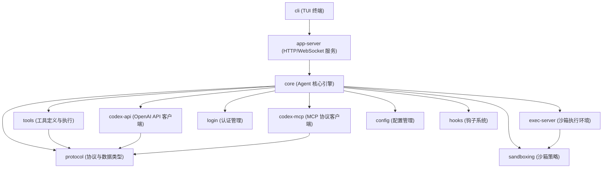
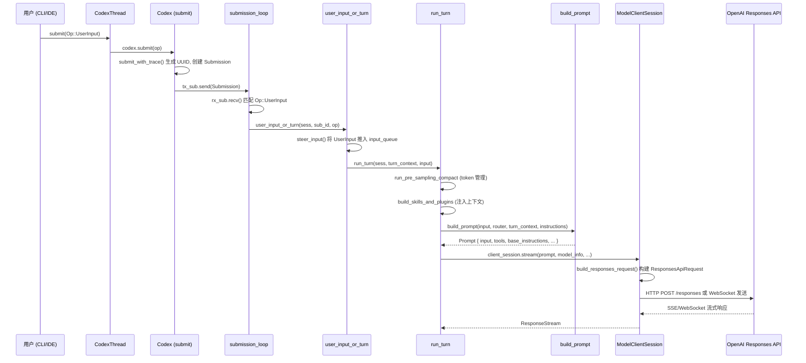
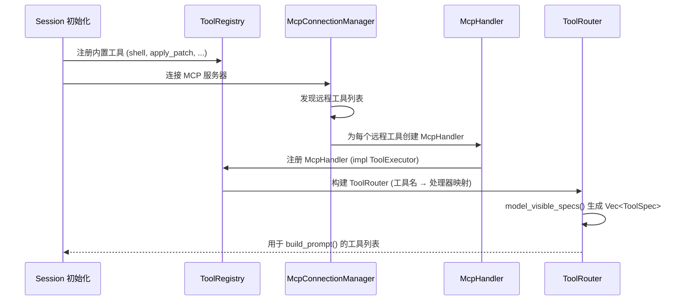
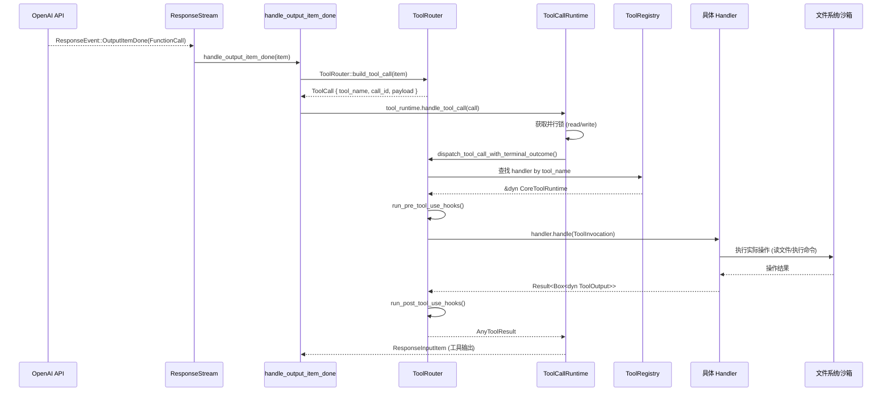
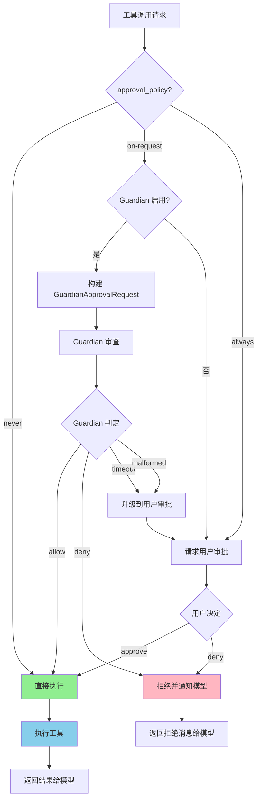
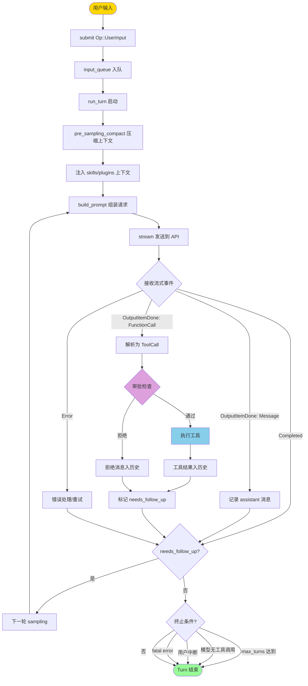
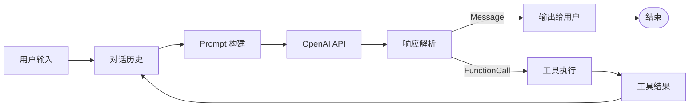

# Codex-rs 核心架构文档

本文档详细描述 codex-rs 系统的三大核心流程，目标是为读者提供足够信息以照着代码复现一个最精简的 agent loop 系统。

---

## 1. 系统总览

### 1.1 架构图



### 1.2 关键 Crate 职责

| Crate | 路径 | 职责 |
|-------|------|------|
| `core` | `codex-rs/core/` | Agent 核心引擎：会话管理、turn 循环、工具调度、Guardian 审批 |
| `tools` | `codex-rs/tools/` | 工具定义（`ToolSpec`）、工具执行 trait（`ToolExecutor`）、JSON schema |
| `codex-api` | `codex-rs/codex-api/` | OpenAI Responses API 客户端，HTTP/WebSocket 传输 |
| `protocol` | `codex-rs/protocol/` | 公共协议类型：`Op`, `Event`, `ResponseItem`, `ResponseInputItem` |
| `exec-server` | `codex-rs/exec-server/` | 命令执行沙箱环境管理 |
| `codex-mcp` | `codex-rs/codex-mcp/` | MCP (Model Context Protocol) 服务器连接管理 |
| `sandboxing` | `codex-rs/sandboxing/` | 沙箱策略计算与执行 |
| `hooks` | `codex-rs/hooks/` | Pre/Post 工具调用钩子 |
| `config` | `codex-rs/config/` | 层级化配置加载与合并 |
| `login` | `codex-rs/login/` | OAuth / API key 认证 |
| `cli` | `codex-rs/cli/` | TUI 终端界面 |
| `app-server` | `codex-rs/app-server/` | HTTP/WebSocket 服务端，供 VS Code 等 IDE 集成 |

---

## 2. 流程一：用户指令 → 模型

用户输入从 CLI/IDE 经过 `CodexThread` → `Session` → `ModelClient` 最终到达 OpenAI Responses API。

### 2.1 序列图



### 2.2 关键代码路径

| 步骤 | 文件 | 函数/结构 | 行号 |
|------|------|-----------|------|
| 1. 用户提交 | `core/src/codex_thread.rs` | `CodexThread::submit()` | L131 |
| 2. 生成 Submission | `core/src/session/mod.rs` | `Codex::submit_with_trace()` | L683 |
| 3. 事件循环 | `core/src/session/handlers.rs` | `submission_loop()` | L716 |
| 4. 分发用户输入 | `core/src/session/handlers.rs` | `user_input_or_turn()` | L86 |
| 5. 输入入队 | `core/src/session/mod.rs` | `steer_input()` → `input_queue.push_pending_input` | L3203 |
| 6. 执行 Turn | `core/src/session/turn.rs` | `run_turn()` | L131 |
| 7. 构建 Prompt | `core/src/session/turn.rs` | `build_prompt()` | L886 |
| 8. 构建 API 请求 | `core/src/client.rs` | `build_responses_request()` | L716 |
| 9. 流式请求 | `core/src/client.rs` | `ModelClientSession::stream()` | L1553 |

### 2.3 核心数据流转

```
Op::UserInput { user_input }
    → Submission { id: UUID, op, trace }
        → steer_input() 推入 Session.input_queue
            → run_turn() 启动异步任务
                → build_prompt() 组装 Prompt
                    → Prompt { input: Vec<ResponseItem>, tools: Vec<ToolSpec>, ... }
                        → build_responses_request() 构建 ResponsesApiRequest
                            → ResponsesApiRequest { model, instructions, input, tools, ... }
                                → HTTP/WebSocket 发送到 OpenAI
```

### 2.4 Prompt 结构

`Prompt` 是发送给模型前的最终抽象（`core/src/client_common.rs:25`）：

```rust
pub struct Prompt {
    pub input: Vec<ResponseItem>,        // 完整对话历史
    pub tools: Vec<ToolSpec>,            // 可用工具列表
    pub parallel_tool_calls: bool,       // 是否允许并行工具调用
    pub base_instructions: BaseInstructions, // 系统指令
    pub personality: Option<Personality>,    // 人格设定
    pub output_schema: Option<Value>,    // 结构化输出 schema
    pub output_schema_strict: bool,      // 是否严格验证 schema
}
```

---

## 3. 流程二：模型读取代码（工具注册与调用）

模型通过 function calling 机制请求执行工具（如读文件、执行命令）。工具系统分为"注册"和"调度"两个阶段。

### 3.1 工具注册序列图



### 3.2 工具调用序列图



### 3.3 关键代码路径

| 步骤 | 文件 | 函数/结构 | 行号 |
|------|------|-----------|------|
| 工具定义 | `tools/src/tool_definition.rs` | `ToolDefinition` | L7 |
| 工具规格 | `tools/src/tool_spec.rs` | `ToolSpec` enum | L17 |
| 序列化为 JSON | `tools/src/tool_spec.rs` | `create_tools_json_for_responses_api()` | L78 |
| 执行 trait | `tools/src/tool_executor.rs` | `ToolExecutor` trait | L38 |
| 核心运行时 trait | `core/src/tools/registry.rs` | `CoreToolRuntime` trait | L46 |
| 构建 ToolCall | `core/src/tools/router.rs` | `ToolRouter::build_tool_call()` | L90 |
| 分发执行 | `core/src/tools/router.rs` | `dispatch_tool_call_with_terminal_outcome()` | L164 |
| 并行调度 | `core/src/tools/parallel.rs` | `ToolCallRuntime::handle_tool_call()` | L62 |
| MCP 处理器 | `core/src/tools/handlers/mcp.rs` | `McpHandler` | L30 |
| MCP 协议调用 | `core/src/mcp_tool_call.rs` | `handle_mcp_tool_call()` | L107 |

### 3.4 工具类型体系

```
ToolSpec (发送给模型的工具描述)
├── Function(ResponsesApiTool)      — 标准函数工具 (shell, read_file, ...)
├── Namespace(ResponsesApiNamespace) — MCP 命名空间工具
├── ToolSearch { ... }               — 延迟加载工具搜索
├── WebSearch { ... }                — 网页搜索
├── ImageGeneration { ... }          — 图像生成
└── Freeform(FreeformTool)           — 自定义工具

ToolExecutor<ToolInvocation> (工具执行接口)
├── CoreToolRuntime (核心工具扩展: hooks, telemetry)
│   ├── ShellHandler               — 执行 shell 命令
│   ├── ApplyPatchHandler          — 应用代码补丁
│   ├── McpHandler                 — MCP 远程工具代理
│   └── ... 其他内置 handler
└── ToolExposure (可见性控制)
    ├── Direct                     — 直接暴露给模型
    ├── Deferred                   — 延迟发现
    └── DirectModelOnly            — 仅模型可见
```

---

## 4. 流程三：模型输出 → 可执行动作

模型的流式响应被解析为 `ResponseItem`，其中的 `FunctionCall` 项经 Guardian 审批后执行。

### 4.1 流式事件处理序列图

```mermaid
sequenceDiagram
    participant API as OpenAI API
    participant Stream as ResponseStream
    participant Loop as try_run_sampling_request (事件循环)
    participant SEU as handle_output_item_done
    participant Runtime as ToolCallRuntime
    participant Guardian as Guardian 审批
    participant Exec as 工具执行
    participant History as 对话历史

    API-->>Stream: SSE 流式事件
    Stream-->>Loop: ResponseEvent::OutputItemDone(item)
    Loop->>SEU: handle_output_item_done(ctx, item)

    alt item 是 FunctionCall
        SEU->>SEU: ToolRouter::build_tool_call(item)
        SEU->>Runtime: handle_tool_call(call, cancel_token)
        Runtime->>Guardian: 检查是否需要审批

        alt 需要审批
            Guardian->>Guardian: review_approval_request()
            alt Guardian 批准
                Guardian-->>Runtime: ReviewDecision::Approved
            else Guardian 拒绝
                Guardian-->>Runtime: ReviewDecision::Denied
                Runtime-->>Loop: 错误响应返回模型
            else 需要用户审批
                Guardian->>Guardian: spawn_approval_request_review()
                Guardian-->>Runtime: 等待用户决定
            end
        end

        Runtime->>Exec: handler.handle(invocation)
        Exec-->>Runtime: ToolOutput
        Runtime-->>Loop: ResponseInputItem (工具结果)
        Loop->>History: 记录工具调用和结果
        Loop->>Loop: needs_follow_up = true
    else item 是 AssistantMessage
        SEU->>History: 记录 assistant 消息
        SEU-->>Loop: needs_follow_up = false
    end
```

### 4.2 Guardian 审批流程



### 4.3 `GuardianApprovalRequest` 变体

```rust
pub enum GuardianApprovalRequest {
    Shell { id, command, cwd, sandbox_permissions, ... },
    ExecCommand { id, command, cwd, tty, ... },
    Execve { id, source, program, argv, cwd, ... },  // Unix only
    ApplyPatch { id, cwd, files, patch },
    NetworkAccess { id, target, host, protocol, port, ... },
    McpToolCall { id, ... },
}
```

### 4.4 关键代码路径

| 步骤 | 文件 | 函数/结构 | 行号 |
|------|------|-----------|------|
| 流式请求入口 | `core/src/session/turn.rs` | `try_run_sampling_request()` | L1712 |
| 事件循环 | `core/src/session/turn.rs` | streaming event loop | L1770 |
| 处理完成项 | `core/src/stream_events_utils.rs` | `handle_output_item_done()` | L343 |
| 并行工具调度 | `core/src/tools/parallel.rs` | `ToolCallRuntime::handle_tool_call()` | L62 |
| 路由分发 | `core/src/tools/router.rs` | `dispatch_tool_call_with_terminal_outcome()` | L164 |
| Guardian 入口 | `core/src/guardian/review.rs` | `review_approval_request()` | L542 |
| 异步审批 | `core/src/guardian/review.rs` | `spawn_approval_request_review()` | L584 |
| 审批请求定义 | `core/src/guardian/approval_request.rs` | `GuardianApprovalRequest` | L17 |
| Guardian 系统概述 | `core/src/guardian/mod.rs` | 模块文档 | L1-12 |

---

## 5. Agent Loop 完整循环

### 5.1 完整循环流程图



### 5.2 循环终止条件

| 条件 | 触发位置 | 说明 |
|------|----------|------|
| 模型仅返回文本 | `try_run_sampling_request` 循环 | `needs_follow_up = false`，turn 自然结束 |
| 用户中断 | `CancellationToken` 触发 | `CodexErr::TurnAborted` |
| Token 超限 | `run_pre_sampling_compact` | `UsageLimitExceeded` 错误 |
| 致命错误 | 任意位置 | `CodexErr::Fatal` 终止整个 session |
| 流断开 | stream event loop | "stream closed before response.completed" |

### 5.3 Turn 内部 Sampling 循环

`run_sampling_request()` 中的核心循环（`core/src/session/turn.rs:947`）：

```
loop {
    1. 获取 prompt_input (首次用传入 input，之后从 history 重建)
    2. build_prompt(prompt_input, router, turn_context, instructions)
    3. try_run_sampling_request(prompt, ...) → SamplingRequestResult
    4. 如果结果包含 tool_outputs → 追加到 history, 继续循环
    5. 如果结果无 follow_up → 退出循环, turn 完成
    6. 如果发生可重试错误 → retries += 1, 继续
}
```

---

## 6. 核心数据结构速查表

| 结构 | 文件 | 用途 |
|------|------|------|
| `Prompt` | `core/src/client_common.rs:25` | 发送给模型的完整请求抽象 |
| `ResponsesApiRequest` | `codex-api` crate | 符合 OpenAI Responses API 的 wire format |
| `ToolCall` | `core/src/tools/router.rs` | 解析后的工具调用（tool_name + call_id + payload） |
| `ToolInvocation` | `core/src/tools/context.rs` | 传递给 handler 的调用上下文 |
| `ToolSpec` | `tools/src/tool_spec.rs:17` | 模型可见的工具描述（JSON 序列化后发送） |
| `ToolExecutor<T>` | `tools/src/tool_executor.rs:38` | 工具执行 trait |
| `CoreToolRuntime` | `core/src/tools/registry.rs:46` | 核心工具运行时扩展 trait |
| `GuardianApprovalRequest` | `core/src/guardian/approval_request.rs:17` | Guardian 审批请求 |
| `GuardianAssessment` | `core/src/guardian/mod.rs:61` | Guardian 审查结果 |
| `ResponseItem` | `protocol` crate | 模型响应中的单个 item（Message/FunctionCall/...） |
| `ResponseInputItem` | `protocol` crate | 对话历史中的单个 item |
| `TurnContext` | `core/src/session/turn_context.rs` | 单次 turn 的完整配置上下文 |
| `Session` | `core/src/session/mod.rs` | 会话状态：历史、配置、服务引用 |
| `Codex` | `core/src/session/mod.rs` | Session 的公共接口封装 |
| `CodexThread` | `core/src/codex_thread.rs:105` | 线程级抽象，供 app-server 使用 |
| `Submission` | `protocol` crate | 用户提交的操作（id + Op + trace） |
| `Op` | `protocol` crate | 操作枚举（UserInput/Interrupt/Shutdown/...） |
| `Event` | `protocol` crate | 系统输出事件（发送给 CLI/IDE） |
| `ToolCallRuntime` | `core/src/tools/parallel.rs` | 管理并行/串行工具执行 |
| `ToolRouter` | `core/src/tools/router.rs` | 工具名到 handler 的路由 |

---

## 7. 最小复现系统所需模块清单

要复现一个最精简的 codex-rs agent loop，需要以下最少组件：

### 7.1 必需模块

| 模块 | 职责 | 最小实现 |
|------|------|----------|
| **Submission Channel** | 接收用户输入 | `async_channel` 或 `tokio::mpsc` |
| **Event Channel** | 输出事件给 UI | `tokio::mpsc` |
| **Session State** | 维护对话历史 | `Vec<ResponseItem>` + `Mutex` |
| **Model Client** | 调用 OpenAI API | HTTP client + SSE 解析 |
| **Prompt Builder** | 组装请求 | 拼接 instructions + history + tools |
| **Tool Router** | 工具调度 | `HashMap<String, Box<dyn ToolExecutor>>` |
| **Tool Handler** | 至少一个工具 | 实现 `ToolExecutor` 的 shell 执行器 |
| **Streaming Parser** | 解析模型输出 | 匹配 `ResponseEvent` 变体 |
| **Turn Loop** | Agent 循环 | `loop { prompt → stream → parse → execute → repeat }` |

### 7.2 可省略的模块

| 模块 | 原因 |
|------|------|
| Guardian 审批 | 精简版可直接自动批准 |
| MCP 连接 | 仅需内置工具即可运行 |
| 沙箱 | 精简版可直接执行 |
| Hooks | 扩展点，非核心逻辑 |
| Compaction | 短对话不需要压缩 |
| Realtime/WebRTC | 高级特性 |
| Skills/Plugins | 扩展系统 |
| Thread Store | 持久化，精简版可内存 |
| Network Proxy | 安全特性 |

### 7.3 最小 Agent Loop 伪代码

```rust
// 精简版 agent loop 骨架
async fn minimal_agent_loop(user_input: String, api_key: &str) {
    let mut history: Vec<ResponseItem> = vec![];
    let tools = register_tools(); // 注册可用工具

    // 添加用户消息到历史
    history.push(ResponseItem::user_message(user_input));

    loop {
        // 1. 构建 Prompt
        let prompt = Prompt {
            input: history.clone(),
            tools: tools.specs(),
            base_instructions: "You are a coding assistant...".into(),
            ..Default::default()
        };

        // 2. 调用模型 (stream)
        let response = call_model(api_key, &prompt).await;

        // 3. 处理响应
        let mut needs_follow_up = false;
        for item in response.output {
            match item {
                ResponseItem::Message(msg) => {
                    println!("{}", msg.content);
                    history.push(item);
                }
                ResponseItem::FunctionCall { name, arguments, call_id, .. } => {
                    history.push(item);

                    // 4. 执行工具
                    let result = tools.execute(&name, &arguments).await;

                    // 5. 工具结果入历史
                    history.push(ResponseItem::tool_output(call_id, result));
                    needs_follow_up = true;
                }
                _ => {}
            }
        }

        // 6. 判断是否继续循环
        if !needs_follow_up {
            break; // Turn 完成
        }
    }
}
```

### 7.4 数据流总结



---

## 附录：文件索引

```
codex-rs/core/src/
├── codex_thread.rs          — CodexThread 公共接口
├── session/
│   ├── mod.rs               — Session/Codex 结构, submit, steer_input
│   ├── handlers.rs          — submission_loop, user_input_or_turn
│   └── turn.rs              — run_turn, build_prompt, try_run_sampling_request
├── client.rs                — ModelClient, build_responses_request, stream
├── client_common.rs         — Prompt 结构定义
├── stream_events_utils.rs   — handle_output_item_done
├── mcp_tool_call.rs         — handle_mcp_tool_call
├── tools/
│   ├── router.rs            — ToolRouter, build_tool_call, dispatch
│   ├── registry.rs          — ToolRegistry, CoreToolRuntime trait
│   ├── parallel.rs          — ToolCallRuntime, 并行执行管理
│   └── handlers/
│       └── mcp.rs           — McpHandler
└── guardian/
    ├── mod.rs               — Guardian 系统概述, GuardianAssessment
    ├── approval_request.rs  — GuardianApprovalRequest 枚举
    ├── review.rs            — review_approval_request, spawn_approval_request_review
    └── review_session.rs    — GuardianReviewSessionManager

codex-rs/tools/src/
├── tool_definition.rs       — ToolDefinition 结构
├── tool_spec.rs             — ToolSpec 枚举, create_tools_json_for_responses_api
└── tool_executor.rs         — ToolExecutor trait, ToolExposure
```
