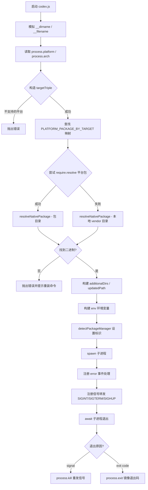
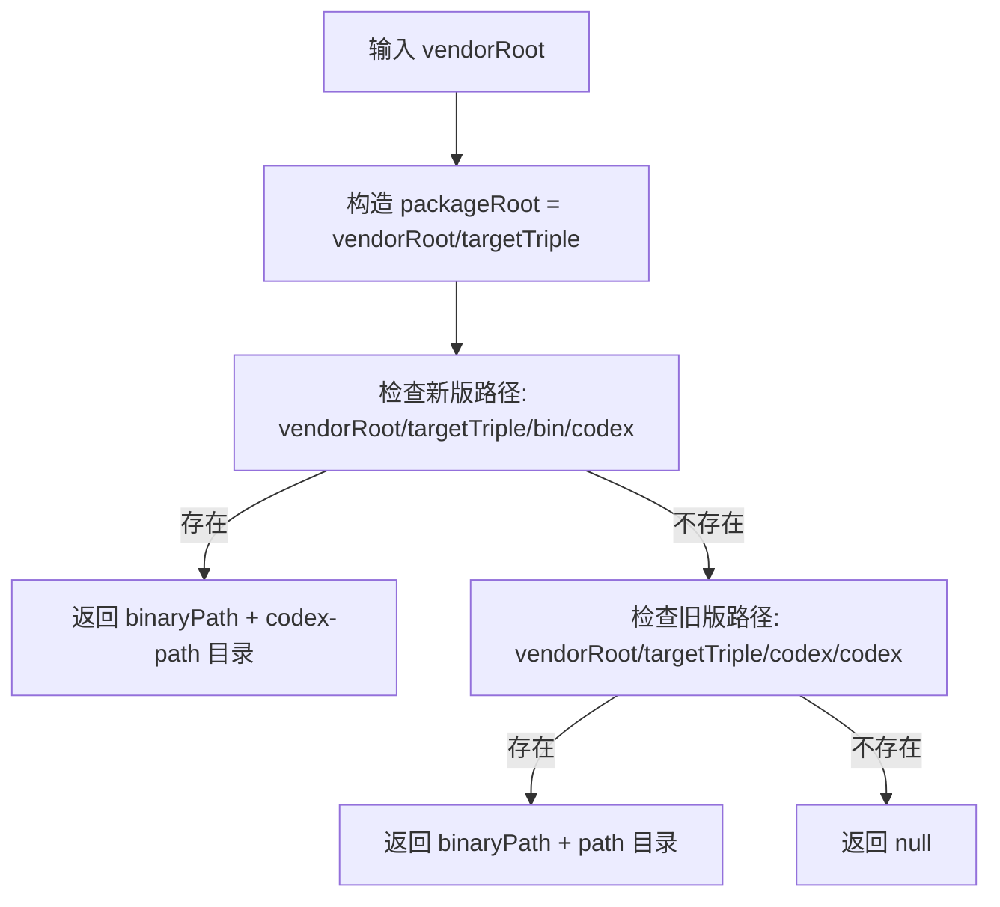
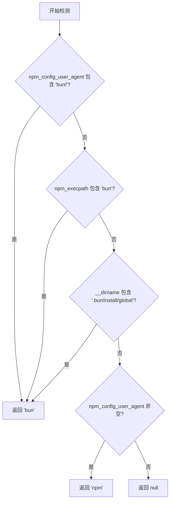
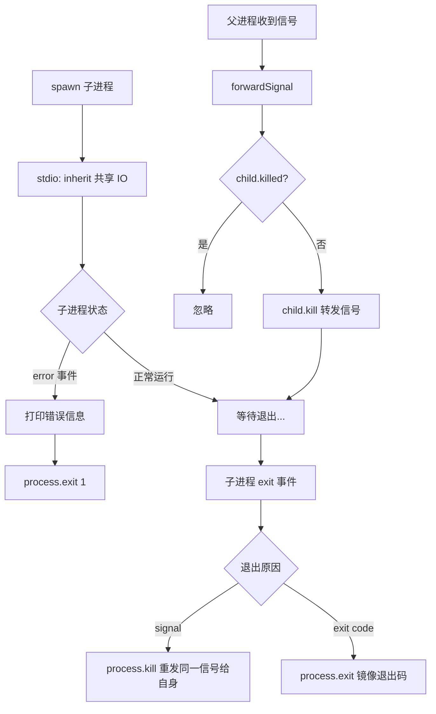

# codex.js 代码解析

## 概述

**文件路径**：`codex-cli/bin/codex.js`（共 239 行）

**文件用途**：Codex CLI 的统一入口脚本（shim）。它本身不包含任何 CLI 逻辑，其职责是：

1. 检测当前运行平台（OS + CPU 架构）
2. 构造 Rust 风格的 target triple
3. 定位对应平台的原生二进制可执行文件
4. 构建子进程环境变量（包括 PATH 注入）
5. 使用 `spawn` 启动原生二进制并转发信号、镜像退出状态

**技术栈**：Node.js ESM 模块、`child_process`、跨平台路径处理

---

## 整体流程图



---

## 模块导入

| 导入项 | 来源 | 用途 |
|--------|------|------|
| `spawn` | `node:child_process` | 异步启动子进程 |
| `existsSync` | `fs` | 同步检查文件/目录是否存在 |
| `realpathSync` | `fs` | 解析符号链接获取真实路径 |
| `createRequire` | `node:module` | 在 ESM 中构造 CJS 风格的 `require` 函数 |
| `path` | `path` | 跨平台路径拼接与解析 |
| `fileURLToPath` | `url` | 将 `import.meta.url`（file:// URL）转换为文件系统路径 |

---

## 变量详解（按出现顺序）

### `__filename`（第 11 行）

```js
const __filename = fileURLToPath(import.meta.url);
```

**含义**：当前脚本的绝对文件路径。ESM 模块中没有 CJS 的 `__filename` 全局变量，因此需要从 `import.meta.url` 手动转换。

---

### `__dirname`（第 12 行）

```js
const __dirname = path.dirname(__filename);
```

**含义**：当前脚本所在目录的绝对路径。同样是 ESM 中模拟 CJS 行为。

---

### `require`（第 13 行）

```js
const require = createRequire(import.meta.url);
```

**含义**：在 ESM 上下文中创建一个 CJS 风格的 `require` 函数，使其能够使用 `require.resolve()` 来定位 `node_modules` 中的包。

---

### `PLATFORM_PACKAGE_BY_TARGET`（第 15-22 行）

```js
const PLATFORM_PACKAGE_BY_TARGET = {
  "x86_64-unknown-linux-musl": "@openai/codex-linux-x64",
  "aarch64-unknown-linux-musl": "@openai/codex-linux-arm64",
  "x86_64-apple-darwin": "@openai/codex-darwin-x64",
  "aarch64-apple-darwin": "@openai/codex-darwin-arm64",
  "x86_64-pc-windows-msvc": "@openai/codex-win32-x64",
  "aarch64-pc-windows-msvc": "@openai/codex-win32-arm64",
};
```

**含义**：target triple 到 npm 平台特定可选依赖包名的映射表。每个平台包内含预编译的原生二进制文件。

**支持矩阵**：

| 操作系统 | 架构 | Target Triple | 包名 |
|----------|------|---------------|------|
| Linux | x64 | x86_64-unknown-linux-musl | @openai/codex-linux-x64 |
| Linux | arm64 | aarch64-unknown-linux-musl | @openai/codex-linux-arm64 |
| macOS | x64 | x86_64-apple-darwin | @openai/codex-darwin-x64 |
| macOS | arm64 | aarch64-apple-darwin | @openai/codex-darwin-arm64 |
| Windows | x64 | x86_64-pc-windows-msvc | @openai/codex-win32-x64 |
| Windows | arm64 | aarch64-pc-windows-msvc | @openai/codex-win32-arm64 |

---

### `platform` / `arch`（第 24 行）

```js
const { platform, arch } = process;
```

**含义**：从 `process` 对象解构当前操作系统标识（`linux`/`darwin`/`win32`）和 CPU 架构标识（`x64`/`arm64`）。

---

### `targetTriple`（第 26-67 行）

```js
let targetTriple = null;
// ... switch-case 逻辑
```

**含义**：Rust 风格的目标三元组字符串，格式为 `{arch}-{vendor}-{os}-{abi}`。通过嵌套 `switch` 语句，将 Node.js 的 `platform` + `arch` 组合映射为对应的 triple。如果平台不受支持，保持为 `null` 并在第 69-71 行抛出错误。

---

### `platformPackage`（第 73 行）

```js
const platformPackage = PLATFORM_PACKAGE_BY_TARGET[targetTriple];
```

**含义**：当前平台对应的 npm 可选依赖包名（如 `@openai/codex-darwin-arm64`）。

---

### `codexBinaryName`（第 78 行）

```js
const codexBinaryName = process.platform === "win32" ? "codex.exe" : "codex";
```

**含义**：可执行文件名。Windows 下为 `codex.exe`，其他平台为 `codex`。

---

### `localVendorRoot`（第 79 行）

```js
const localVendorRoot = path.join(__dirname, "..", "vendor");
```

**含义**：本地 vendor 目录路径（`codex-cli/vendor/`）。当通过 `require.resolve` 找不到平台包时，回退到这个本地目录查找二进制。

---

### `packageBinaryPath`（第 80-81 行）

```js
const packageBinaryPath = (vendorRoot) =>
  path.join(vendorRoot, targetTriple, "bin", codexBinaryName);
```

**含义**：新版目录结构的二进制路径构造函数。路径格式：`{vendorRoot}/{targetTriple}/bin/codex`。

---

### `legacyBinaryPath`（第 82-83 行）

```js
const legacyBinaryPath = (vendorRoot) =>
  path.join(vendorRoot, targetTriple, "codex", codexBinaryName);
```

**含义**：旧版目录结构的二进制路径构造函数。路径格式：`{vendorRoot}/{targetTriple}/codex/codex`。用于向后兼容早期版本的包布局。

---

### `nativePackage`（第 106-114 行）

```js
let nativePackage;
try {
  const packageJsonPath = require.resolve(`${platformPackage}/package.json`);
  nativePackage = resolveNativePackage(
    path.join(path.dirname(packageJsonPath), "vendor"),
  );
} catch {
  nativePackage = resolveNativePackage(localVendorRoot);
}
```

**含义**：解析后的原生包信息对象 `{ binaryPath, pathDir }`。首先尝试通过 `require.resolve` 找到已安装的平台包，失败则回退到本地 vendor 目录。

---

### `binaryPath` / `pathDir`（第 127 行）

```js
const { binaryPath, pathDir } = nativePackage;
```

**含义**：
- `binaryPath`：最终确定的原生二进制可执行文件绝对路径
- `pathDir`：需要追加到 `PATH` 环境变量的额外目录（包含辅助工具）

---

### `additionalDirs`（第 170-173 行）

```js
const additionalDirs = [];
if (existsSync(pathDir)) {
  additionalDirs.push(pathDir);
}
```

**含义**：需要追加到 `PATH` 的额外目录列表。只有当 `pathDir` 实际存在时才添加。

---

### `updatedPath`（第 174 行）

```js
const updatedPath = getUpdatedPath(additionalDirs);
```

**含义**：合并后的完整 `PATH` 字符串，将额外目录插入到系统 PATH 最前面。

---

### `env`（第 176 行）

```js
const env = { ...process.env, PATH: updatedPath };
```

**含义**：传递给子进程的环境变量副本。基于当前进程环境，覆盖了 `PATH` 为更新后的值。

---

### `packageManagerEnvVar`（第 177-180 行）

```js
const packageManagerEnvVar =
  detectPackageManager() === "bun"
    ? "CODEX_MANAGED_BY_BUN"
    : "CODEX_MANAGED_BY_NPM";
```

**含义**：标识安装来源的环境变量名。值为 `"CODEX_MANAGED_BY_BUN"` 或 `"CODEX_MANAGED_BY_NPM"`，告诉原生二进制自己是通过哪个包管理器安装的。

---

### `child`（第 184-187 行）

```js
const child = spawn(binaryPath, process.argv.slice(2), {
  stdio: "inherit",
  env,
});
```

**含义**：`spawn` 返回的子进程对象（`ChildProcess` 实例）。使用 `stdio: "inherit"` 使子进程直接共享父进程的标准输入/输出/错误流。

---

### `forwardSignal`（第 202-211 行）

```js
const forwardSignal = (signal) => {
  if (child.killed) {
    return;
  }
  try {
    child.kill(signal);
  } catch {
    /* ignore */
  }
};
```

**含义**：信号转发闭包。接收信号名称，若子进程尚未被杀死则将信号转发给它。`try-catch` 防止在子进程已退出后发送信号导致的异常。

---

### `childResult`（第 222-230 行）

```js
const childResult = await new Promise((resolve) => {
  child.on("exit", (code, signal) => {
    if (signal) {
      resolve({ type: "signal", signal });
    } else {
      resolve({ type: "code", exitCode: code ?? 1 });
    }
  });
});
```

**含义**：Promise resolve 的子进程退出描述对象。有两种形态：
- `{ type: "signal", signal: "SIGTERM" }` — 子进程被信号终止
- `{ type: "code", exitCode: 0 }` — 子进程正常退出，附带退出码

---

## 函数详解

### `resolveNativePackage(vendorRoot)`（第 85-104 行）

**作用**：在给定的 vendor 目录下查找原生二进制文件，兼容新旧两种目录结构。

**参数**：
- `vendorRoot`：vendor 目录的绝对路径

**返回值**：
- 成功：`{ binaryPath: string, pathDir: string }`
- 失败：`null`

**查找逻辑**：



**设计说明**：

两种目录结构的差异：

| 版本 | 二进制路径 | PATH 辅助目录 |
|------|-----------|--------------|
| 新版 | `{vendor}/{triple}/bin/codex` | `{vendor}/{triple}/codex-path` |
| 旧版 | `{vendor}/{triple}/codex/codex` | `{vendor}/{triple}/path` |

先检查新版再检查旧版，确保向后兼容。

---

### `getUpdatedPath(newDirs)`（第 135-143 行）

**作用**：将额外目录拼接到系统 `PATH` 环境变量的前端。

**参数**：
- `newDirs`：需要追加的目录路径数组

**返回值**：合并后的 PATH 字符串

**原理**：
1. 确定路径分隔符（Windows 为 `;`，Unix 为 `:`）
2. 将现有 PATH 按分隔符拆分并过滤空值
3. 将 `newDirs` 置于数组最前面，再用分隔符重新拼接

将新目录放在 PATH 最前面，确保 Codex 附带的辅助工具优先于系统中可能存在的同名工具被找到。

---

### `detectPackageManager()`（第 149-168 行）

**作用**：启发式检测安装 Codex 时使用的包管理器，以便在出错时给用户提供正确的重装命令。

**返回值**：`"bun"` | `"npm"` | `null`

**检测流程**：



**检测原理**：

| 优先级 | 检查项 | 说明 |
|--------|--------|------|
| 1 | `npm_config_user_agent` | npm/bun 在运行脚本时注入，格式如 `bun/1.x.x` |
| 2 | `npm_execpath` | 包管理器可执行文件路径 |
| 3 | `__dirname` 路径特征 | bun 全局安装目录包含 `.bun/install/global` |
| 4 | 回退 | 若 user_agent 存在则推断为 npm，否则返回 null |

---

## 子进程生命周期

### 生命周期流程图



### spawn 配置

```js
spawn(binaryPath, process.argv.slice(2), {
  stdio: "inherit",
  env,
});
```

- **`binaryPath`**：原生二进制的绝对路径
- **`process.argv.slice(2)`**：透传用户传入的所有命令行参数（跳过 `node` 和脚本路径）
- **`stdio: "inherit"`**：子进程继承父进程的 stdin/stdout/stderr，实现透明的 IO 透传
- **`env`**：经过修改的环境变量副本

### error 事件处理

当二进制文件不存在或不可执行时触发。打印错误堆栈后以退出码 1 终止父进程。

### 信号转发机制

监听三个常见终止信号：`SIGINT`（Ctrl+C）、`SIGTERM`（kill 默认信号）、`SIGHUP`（终端断开）。

收到信号后：
1. 检查子进程是否已被杀死（`child.killed`）
2. 若仍存活，通过 `child.kill(signal)` 将同一信号转发
3. 不立即退出父进程，而是等待子进程的 `exit` 事件

### 退出状态镜像

子进程退出后，父进程根据退出原因做出对应处理：

| 退出原因 | 父进程行为 | 效果 |
|----------|-----------|------|
| 被信号杀死 | `process.kill(process.pid, signal)` | 父进程以相同信号终止，退出码为 128 + 信号编号 |
| 正常退出 | `process.exit(exitCode)` | 父进程使用相同的退出码退出 |

---

## 设计原理

### 为什么用异步 `spawn` 而非 `spawnSync`？

`spawnSync` 会阻塞 Node.js 事件循环，导致父进程无法响应信号（如 `SIGINT`）。使用异步 `spawn` + `await Promise` 的模式：

- Node.js 事件循环保持活跃
- 能够注册信号处理器并将信号转发给子进程
- 子进程可以优雅关闭（graceful shutdown），而不是被操作系统强制杀死

### 为什么需要信号转发？

当用户按下 Ctrl+C 时：
- 如果不转发信号，子进程可能不会收到 `SIGINT`（取决于进程组配置）
- 转发机制确保无论何种情况，子进程都能收到终止请求
- 子进程可以执行自己的清理逻辑（如保存状态、释放资源）

### 为什么镜像退出状态？

Shell 脚本和 CI/CD 工具依赖进程退出码来判断命令是否成功：
- 退出码 0 = 成功
- 非零退出码 = 失败（不同的码表示不同的错误类型）
- 信号终止 = 退出码 128 + 信号编号（如 SIGINT=2，退出码 130）

如果父进程不镜像子进程的退出状态，外部工具会误以为命令成功完成（因为父进程默认退出码为 0）。

### 为什么使用 require.resolve 定位平台包？

npm 的 `optionalDependencies` 机制会根据平台自动安装对应的原生包。使用 `require.resolve` 可以：
- 利用 Node.js 的模块解析算法找到包的实际安装位置
- 兼容不同的 node_modules 布局（扁平、嵌套、pnpm symlink 等）
- 无需硬编码路径

### 为什么需要两种目录结构兼容？

随着项目演进，二进制文件的打包布局发生了变化。`resolveNativePackage` 先检查新结构再回退旧结构，确保：
- 用户升级后使用新布局
- 尚未升级的用户仍然能正常运行
