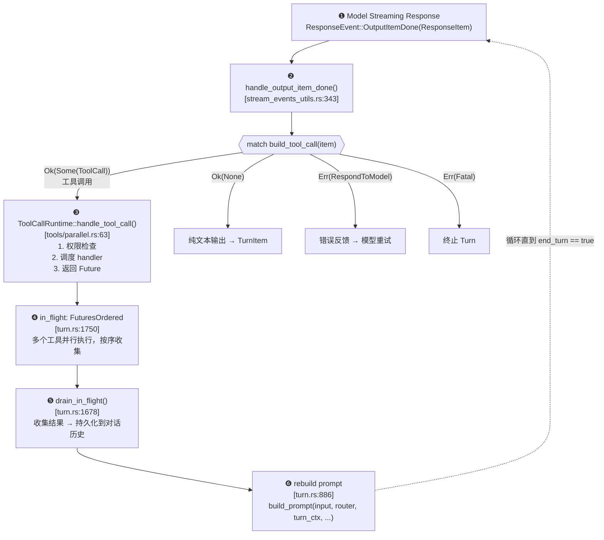
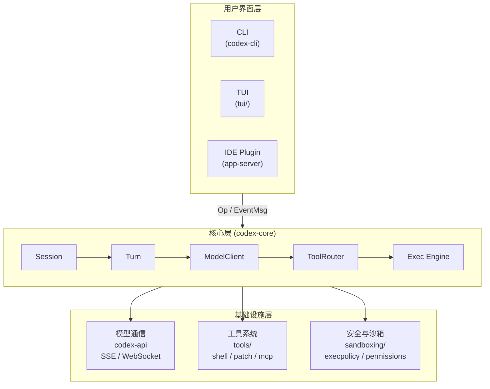

# Codex 工程学习路线与计划

## 项目概述

Codex 是 OpenAI 的本地编程 Agent CLI 工具，支持 CLI、TUI、IDE 插件和桌面应用等多种交互方式。核心使用 Rust 实现（116+ crates），外层有 Node.js CLI 包装、Python SDK 和 TypeScript SDK。

**核心能力：** 对话式编程助手 + 安全沙箱执行 + 多模型支持 + IDE 集成

---

## 学习路线（分 6 个阶段）

### 阶段 1：项目全貌与环境搭建

**目标：** 能构建、运行、调试项目

**学习内容：**
- 阅读 `README.md` 了解产品定位
- 阅读 `docs/install.md` 了解安装方式
- 阅读 `docs/contributing.md` 了解贡献流程
- 熟悉 `justfile` 中的开发命令

**动手实践：**
```bash
cd codex-rs
cargo build                    # 构建
just test                      # 测试
just codex "hello"             # 运行
tail -F ~/.codex/log/codex-tui.log  # 查看日志
```

**关键文件：**
- `/README.md`
- `/docs/install.md`
- `/docs/contributing.md`
- `/codex-rs/Cargo.toml`（workspace 定义）
- `/justfile`

---

### 阶段 2：入口与启动流程

**目标：** 理解从用户输入命令到 Agent 启动的完整链路

**学习内容：**
1. **Node.js 入口** — `codex-cli/bin/codex.js`
   - 检测平台/架构，spawn Rust 二进制
2. **Rust CLI 入口** — `codex-rs/cli/src/main.rs`
   - Clap 命令解析（exec / app / login / tui 等子命令）
3. **TUI 入口** — `codex-rs/tui/src/main.rs`
   - Ratatui 终端 UI 初始化
4. **配置加载** — `codex-rs/core/src/config/mod.rs`
   - ConfigLayerStack 分层配置解析

**关键文件：**
- `/codex-cli/bin/codex.js`
- `/codex-rs/cli/src/main.rs`
- `/codex-rs/tui/src/main.rs`
- `/codex-rs/core/src/config/mod.rs`（~3,971 行）
- `/codex-rs/config/src/`

---

### 阶段 3：核心会话与 Turn 模型

**目标：** 理解 Agent 的核心运行循环

**核心概念：**
```
Session（会话）
  └── Turn（一轮对话）
       ├── 用户输入 → Op::UserInput
       ├── 模型推理 → ModelClientSession.stream()
       ├── 工具调用 → ToolRouter.dispatch()
       └── 输出事件 → EventMsg::TurnComplete
```

**学习内容：**
1. **Session** — `codex-rs/core/src/session/session.rs`
   - 会话生命周期管理
   - 事件队列（async_channel）
2. **Turn** — `codex-rs/core/src/session/turn.rs`
   - 单轮对话的状态机
3. **Turn Context** — `codex-rs/core/src/session/turn_context.rs`
   - 技能注入、环境选择、工具调用跟踪
4. **Model Client** — `codex-rs/core/src/client.rs`（~2,228 行）
   - SSE/WebSocket 流式通信
   - 重试与认证逻辑

**关键文件：**
- `/codex-rs/core/src/session/session.rs`
- `/codex-rs/core/src/session/turn.rs`
- `/codex-rs/core/src/session/turn_context.rs`
- `/codex-rs/core/src/client.rs`

---

### 深入：模型输出 → 具体行动 的完整链路

> 本节是对阶段 3 的延伸，聚焦于 **一次模型推理完成后，系统如何将输出转化为实际工具调用并把结果反馈给模型** 的完整路径。建议在读完阶段 3 后、进入阶段 4 之前深入阅读。

#### 数据流图



#### 推荐阅读顺序

| 序号 | 文件 | 关键行号 | 关注点 |
|------|------|----------|--------|
| 1 | `codex-rs/codex-api/src/common.rs` | 72-111 | `ResponseEvent` 枚举 — 模型流式输出的所有事件类型 |
| 2 | `codex-rs/core/src/session/turn.rs` | 1811-2033 | `try_run_sampling_request()` — 事件循环主体 |
| 3 | `codex-rs/core/src/stream_events_utils.rs` | 343-453 | `handle_output_item_done()` — 输出分发的核心决策点 |
| 4 | `codex-rs/core/src/tools/router.rs` | 90-137 | `ToolRouter::build_tool_call()` — 判断是否为工具调用 |
| 5 | `codex-rs/core/src/tools/parallel.rs` | 63-165 | `ToolCallRuntime::handle_tool_call()` — 工具执行入口 |
| 6 | `codex-rs/core/src/session/turn.rs` | 1678-1702 | `drain_in_flight()` — 收集工具结果 |
| 7 | `codex-rs/core/src/session/turn.rs` | 886-960 | `build_prompt()` + 重建提示词逻辑 |

#### 核心决策逻辑伪代码

```rust
// stream_events_utils.rs:343 — handle_output_item_done()
fn handle_output_item_done(ctx, item, previously_streamed) -> HandleResult {
    match ToolRouter::build_tool_call(item.clone()) {
        // ═══ 路径 A：识别为工具调用 ═══
        Ok(Some(tool_call)) => {
            // 1. 向 UI 发出 "工具调用开始" 事件
            emit_turn_item(TurnItem::ToolCall { ... });

            // 2. 启动异步工具执行
            let future = ctx.tool_runtime.handle_tool_call(
                tool_call,
                cancellation_token,
            );

            // 3. 标记需要后续推理
            HandleResult {
                tool_future: Some(future),
                needs_follow_up: true,
            }
        }

        // ═══ 路径 B：普通消息输出 ═══
        Ok(None) => {
            // 将 ResponseItem 转为 TurnItem（文本/推理内容）
            let turn_item = to_turn_item(item);
            emit_turn_item(turn_item);
            record_to_history(item);

            HandleResult::default()
        }

        // ═══ 路径 C：工具调用解析失败，需告知模型 ═══
        Err(FunctionCallError::RespondToModel(msg)) => {
            let error_response = ResponseInputItem::FunctionCallOutput {
                call_id,
                output: FunctionCallOutputPayload {
                    body: Text(msg),
                    success: Some(false),
                },
            };
            HandleResult {
                tool_future: Some(ready(Ok(error_response))),
                needs_follow_up: true,
            }
        }

        // ═══ 路径 D：致命错误，中止 Turn ═══
        Err(FunctionCallError::Fatal(msg)) => {
            return Err(CodexError::Fatal(msg));
        }
    }
}
```

#### 关键数据结构说明

| 结构体/枚举 | 文件位置 | 作用 |
|-------------|----------|------|
| `ResponseEvent` | `codex-api/src/common.rs:72` | 模型流式响应事件（Created / OutputItemDone / Completed 等） |
| `ResponseItem` | `protocol/src/models.rs` | 模型输出的单个条目（FunctionCall / Message / CustomToolCall 等） |
| `ToolCall` | `core/src/tools/router.rs:27` | 已识别的工具调用请求（tool_name + call_id + payload） |
| `ToolPayload` | `core/src/tools/router.rs` | 工具调用载荷（Function / ToolSearch / Custom） |
| `ResponseInputItem` | `protocol/src/models.rs:672` | 反馈给模型的条目（FunctionCallOutput / McpToolCallOutput 等） |
| `FunctionCallOutputPayload` | `protocol/src/models.rs:1378` | 工具执行结果（body: Text 或 ContentItems + success 标记） |
| `Prompt` | `core/src/session/turn.rs:886` | 发送给模型的完整提示（input 历史 + tools 列表 + instructions） |
| `TurnContext` | `core/src/session/turn_context.rs:51` | 单轮上下文（模型信息 / 技能 / 工具运行时 / 取消令牌） |

#### 理解要点

1. **循环直到 end_turn** — 模型可能连续发出多个工具调用；每次工具完成后都会把结果追加到对话历史，然后重新调用模型，直到模型返回 `end_turn: true`。
2. **并行工具调用** — `in_flight` 使用 `FuturesOrdered` 管理多个并发工具执行，模型若支持 `parallel_tool_calls`，可一次返回多个 FunctionCall。
3. **错误不中断循环** — 工具执行失败时，系统将错误信息包装为 `FunctionCallOutput(success: false)` 发回给模型，让模型自行决定如何处理（重试/换方案/报告用户）。
4. **权限拦截点** — 在 `handle_tool_call()` 内部，`exec_policy` 和沙箱规则会在实际执行前检查权限，被拒绝的调用同样以错误形式反馈模型。

---

### 阶段 4：工具系统与执行引擎

**目标：** 理解 Agent 如何执行命令和操作文件

**学习内容：**
1. **工具注册与路由** — `codex-rs/core/src/tools/mod.rs`
   - ToolHandler trait
   - Tool registry & dispatch
2. **Shell 执行** — `codex-rs/core/src/tools/shell/`
   - 命令构建、输出捕获、超时处理
3. **Patch 应用** — `codex-rs/core/src/tools/apply_patch/`
   - 代码补丁的应用逻辑
4. **MCP 工具** — `codex-rs/core/src/tools/mcp/`
   - Model Context Protocol 集成
5. **并行执行** — `codex-rs/core/src/tools/parallel/`
6. **执行引擎** — `codex-rs/core/src/exec.rs`
   - 进程管理、信号处理

**关键文件：**
- `/codex-rs/core/src/tools/mod.rs`
- `/codex-rs/core/src/exec.rs`
- `/codex-rs/core/src/tools/shell/`
- `/codex-rs/core/src/tools/apply_patch/`

---

### 阶段 5：安全模型与沙箱系统

**目标：** 理解 Codex 的安全架构

**学习内容：**
1. **权限模型** — Permission Profiles
   - FileSystemSandboxPolicy（文件系统隔离）
   - NetworkSandboxPolicy（网络隔离）
2. **执行策略** — `codex-rs/core/src/exec_policy.rs`（~3,661 行）
   - `.rules` 文件解析
   - 危险命令检测
   - 安全命令白名单
3. **沙箱后端**
   - macOS: seatbelt — `codex-rs/sandboxing/`
   - Linux: bwrap（Bubblewrap）— `codex-rs/linux-sandbox/`
   - Windows: AppContainer — `codex-rs/windows-sandbox-rs/`
4. **审批流程** — AskForApproval 枚举
   - 请求 → 等待 → 修正策略 → 继续执行

**关键文件：**
- `/codex-rs/core/src/sandboxing/mod.rs`
- `/codex-rs/core/src/exec_policy.rs`
- `/codex-rs/sandboxing/src/`
- `/codex-rs/protocol/src/protocol.rs`（PermissionProfile 定义）

---

### 阶段 6：协议层与 SDK 集成

**目标：** 理解 IDE 集成和外部 SDK 如何与核心交互

**学习内容：**
1. **Protocol 类型** — `codex-rs/protocol/src/protocol.rs`（~188KB）
   - Op 枚举（输入操作）
   - EventMsg 枚举（输出事件）
   - TurnItem（会话产物）
2. **App-Server** — JSON-RPC 2.0 协议
   - stdio / WebSocket / Unix socket 传输
   - `codex-rs/app-server/src/main.rs`
   - `codex-rs/app-server-protocol/src/`
3. **Python SDK** — `sdk/python/`
   - Pydantic 模型 + async/sync 支持
4. **TypeScript SDK** — `sdk/typescript/`
   - 协议自动生成的类型定义

**关键文件：**
- `/codex-rs/protocol/src/protocol.rs`
- `/codex-rs/app-server/src/main.rs`
- `/codex-rs/app-server-protocol/src/`
- `/sdk/python/`
- `/sdk/typescript/`

---

## 架构总览图



---

## 推荐阅读顺序（按优先级）

| 优先级 | 文件 | 行数 | 说明 |
|--------|------|------|------|
| 1 | `codex-rs/cli/src/main.rs` | ~200 | 程序入口，理解子命令结构 |
| 2 | `codex-rs/core/src/session/session.rs` | ~500 | 核心会话，理解运行循环 |
| 3 | `codex-rs/core/src/session/turn.rs` | ~400 | 单轮对话逻辑 |
| 4 | `codex-rs/core/src/tools/mod.rs` | ~300 | 工具系统入口 |
| 5 | `codex-rs/core/src/exec.rs` | ~600 | 命令执行引擎 |
| 6 | `codex-rs/core/src/client.rs` | ~2228 | 模型 API 通信 |
| 7 | `codex-rs/core/src/config/mod.rs` | ~3971 | 配置系统 |
| 8 | `codex-rs/core/src/exec_policy.rs` | ~3661 | 安全策略 |
| 9 | `codex-rs/protocol/src/protocol.rs` | ~5000+ | 协议类型定义 |
| 10 | `codex-rs/app-server/src/main.rs` | ~300 | IDE 集成入口 |

---

## 技术栈速查

| 领域 | 技术 |
|------|------|
| 语言 | Rust (Edition 2024), TypeScript, Python |
| 异步运行时 | Tokio |
| 终端 UI | Ratatui |
| HTTP 框架 | Axum |
| gRPC | Tonic |
| 序列化 | Serde (JSON) |
| 数据库 | SQLite (via SQLx) |
| CLI 框架 | Clap |
| 构建系统 | Bazel + Cargo |
| 包管理 | pnpm (Node.js) |
| 测试 | Nextest, Jest, pytest |
| 日志 | Tracing |

---

## 学习建议

1. **先跑起来** — 先 `cargo build` + `just codex "hello"` 确认环境正常
2. **自顶向下** — 从 `cli/src/main.rs` 开始，顺着调用链往下读
3. **善用日志** — `RUST_LOG=codex_core=debug` 观察运行时行为
4. **聚焦一条线** — 先只跟踪 "用户输入 → 模型调用 → 工具执行 → 返回结果" 这条主线
5. **对照协议** — 读 `protocol.rs` 中的 Op/EventMsg 枚举，理解系统的输入输出边界
6. **写小测试** — 在感兴趣的 crate 中写单元测试来验证理解
