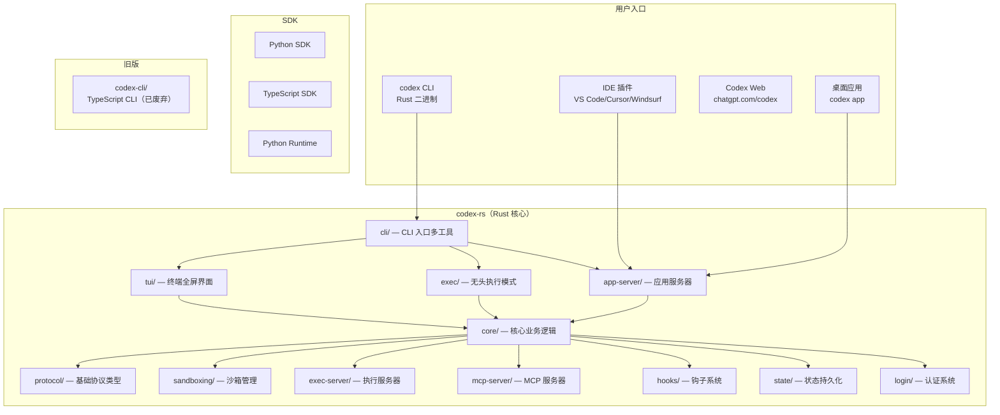

# Codex 项目总览

## 功能概述

Codex 是 OpenAI 开发的本地运行编码代理（Coding Agent），提供命令行界面（CLI）和桌面应用体验。用户可以通过自然语言与 Codex 交互，完成代码编写、调试、重构等软件工程任务。Codex 支持沙箱化执行，确保安全性；同时集成了 MCP（Model Context Protocol）协议，可扩展工具能力。

主要特性：
- **本地运行**：所有代码操作在用户本机完成，无需上传到云端
- **多种安装方式**：npm、Homebrew、GitHub Release 二进制文件
- **灵活认证**：支持 ChatGPT 账户登录和 API Key
- **沙箱安全**：可配置的沙箱策略（只读、工作区写入、完全访问）
- **MCP 支持**：既可作为 MCP 客户端连接外部工具，也可作为 MCP 服务器被其他代理调用
- **多模式运行**：交互式 TUI、非交互式 exec 模式、IDE 插件、桌面应用

## 架构说明

## 目录结构

| 目录/文件 | 说明 |
|-----------|------|
| `codex-rs/` | **Rust 工作区**：核心实现，包含 84 个 crate，是项目主体 |
| `codex-cli/` | **旧版 TypeScript CLI**：已被 Rust 实现取代，保留用于参考 |
| `sdk/` | **SDK 目录**：Python SDK、Python Runtime、TypeScript SDK |
| `docs/` | **文档目录**：配置指南、贡献指南、安装说明等 |
| `.github/` | GitHub Actions CI/CD 工作流和配置 |
| `scripts/` | 构建和发布脚本 |
| `patches/` | 第三方依赖补丁 |
| `third_party/` | 第三方代码 |
| `tools/` | 开发工具（如参数注释 lint） |
| `.codex/` | Codex 项目级配置 |
| `.devcontainer/` | Dev Container 配置 |
| `.vscode/` | VS Code 工作区配置 |
| `justfile` | Just 任务运行器配置 |
| `MODULE.bazel` | Bazel 构建系统模块定义 |
| `package.json` | Node.js 包管理（pnpm 工作区根） |
| `flake.nix` | Nix 开发环境配置 |

## 依赖关系

### 构建系统
- **Cargo**：Rust 包管理器，主要构建系统
- **Bazel**：可选构建系统，用于 CI 和大规模构建
- **pnpm**：Node.js 包管理器，管理 TypeScript 相关依赖
- **Nix**：可选开发环境管理

### 外部服务
- **OpenAI API**：AI 模型调用（通过 Responses API）
- **ChatGPT 认证**：用户登录和计划管理
- **MCP 协议**：工具扩展协议

### 许可证
- Apache-2.0 开源许可

## 核心接口/API

### CLI 命令
- `codex` — 启动交互式 TUI 界面
- `codex exec <PROMPT>` — 非交互式执行任务
- `codex app` — 启动桌面应用体验
- `codex mcp-server` — 作为 MCP 服务器运行
- `codex mcp` — 管理 MCP 服务器配置
- `codex sandbox <platform>` — 测试沙箱行为
- `codex debug` — 调试工具

### 配置
- `~/.codex/config.toml` — 全局配置文件
- `.codex/` 项目目录 — 项目级配置
- 环境变量 — `RUST_LOG` 等运行时配置
