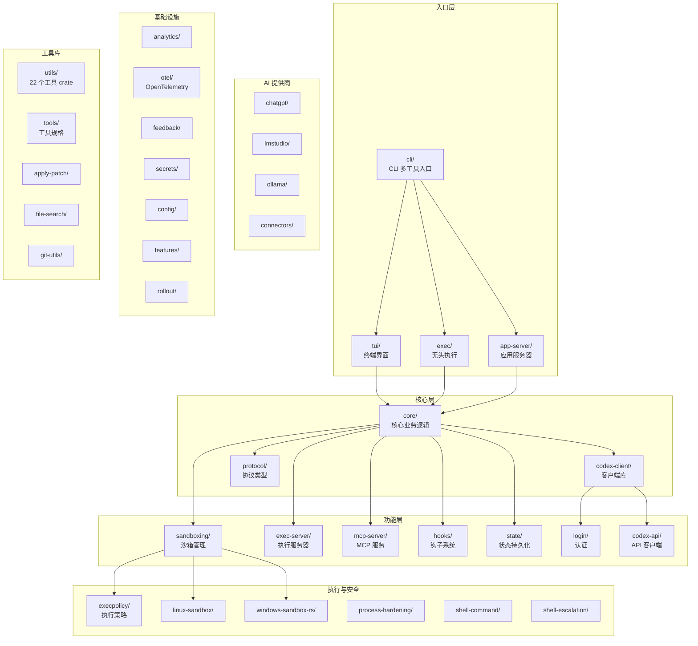

# codex-rs — Rust 工作区

## 功能概述

`codex-rs/` 是 Codex 项目的核心 Rust 实现，组织为一个 Cargo 工作区（workspace），包含 84 个 crate。这是 Codex CLI 的主要代码库，取代了之前的 TypeScript 实现，提供零依赖的原生可执行文件安装体验。

工作区使用 Rust 2024 edition，采用 Apache-2.0 许可证。所有 crate 以 `codex-` 为前缀命名（如 `core/` 目录的 crate 名为 `codex-core`）。

## 架构说明



## 目录结构

### 核心 Crate（按依赖层次）

| Crate 目录 | Crate 名 | 说明 |
|------------|----------|------|
| `protocol/` | codex-protocol | 基础协议类型定义 |
| `codex-api/` | codex-api | OpenAI API 客户端 |
| `sandboxing/` | codex-sandboxing | 跨平台沙箱管理 |
| `exec-server/` | codex-exec-server | 命令执行服务器 |
| `hooks/` | codex-hooks | 生命周期钩子系统 |
| `mcp-server/` | codex-mcp-server | MCP 服务器实现 |
| `state/` | codex-state | 状态持久化（SQLite） |
| `login/` | codex-login | 用户认证 |
| `codex-client/` | codex-client | 高层客户端库 |
| `core/` | codex-core | **核心业务逻辑**（最大 crate） |
| `app-server/` | codex-app-server | WebSocket 应用服务器 |
| `tui/` | codex-tui | 终端用户界面（Ratatui） |
| `exec/` | codex-exec | 无头/自动化执行 |
| `cli/` | codex-cli（Rust） | CLI 入口，子命令分发 |

### 执行与安全 Crate

| Crate 目录 | 说明 |
|------------|------|
| `execpolicy/` | 命令执行策略引擎 |
| `execpolicy-legacy/` | 旧版执行策略 |
| `linux-sandbox/` | Linux Landlock/seccomp 沙箱 |
| `windows-sandbox-rs/` | Windows 沙箱 |
| `process-hardening/` | 进程安全加固 |
| `shell-command/` | Shell 命令解析 |
| `shell-escalation/` | Shell 权限升级检测 |

### AI 提供商集成

| Crate 目录 | 说明 |
|------------|------|
| `chatgpt/` | ChatGPT 集成 |
| `lmstudio/` | LM Studio 本地模型 |
| `ollama/` | Ollama 本地模型 |
| `connectors/` | 模型连接器抽象 |

### API 与客户端

| Crate 目录 | 说明 |
|------------|------|
| `app-server-client/` | 应用服务器客户端 |
| `app-server-protocol/` | 应用服务器协议定义 |
| `app-server-test-client/` | 应用服务器测试客户端 |
| `backend-client/` | 后端 API 客户端 |
| `codex-backend-openapi-models/` | OpenAPI 模型定义 |
| `responses-api-proxy/` | Responses API 代理 |
| `rmcp-client/` | RMCP 客户端 |

### 基础设施

| Crate 目录 | 说明 |
|------------|------|
| `analytics/` | 使用分析 |
| `otel/` | OpenTelemetry 集成 |
| `feedback/` | 反馈收集 |
| `secrets/` | 密钥管理 |
| `keyring-store/` | 系统密钥环 |
| `config/` | 配置管理 |
| `features/` | 功能开关 |
| `rollout/` | 灰度发布 |

### 工具与服务

| Crate 目录 | 说明 |
|------------|------|
| `tools/` | 工具规格定义 |
| `apply-patch/` | 补丁应用工具 |
| `file-search/` | 文件搜索 |
| `git-utils/` | Git 操作工具 |
| `code-mode/` | 代码模式 |
| `skills/` | 技能系统 |
| `core-skills/` | 核心技能 |

### 小型工具

| Crate 目录 | 说明 |
|------------|------|
| `ansi-escape/` | ANSI 转义序列处理 |
| `arg0/` | 进程名称工具 |
| `async-utils/` | 异步工具函数 |
| `stdio-to-uds/` | stdio 到 Unix Domain Socket 桥接 |
| `v8-poc/` | V8 引擎实验 |
| `debug-client/` | 调试客户端 |
| `terminal-detection/` | 终端类型检测 |

### 工具库子目录

`utils/` — 包含 22 个独立工具 crate（absolute-path, cache, cli, elapsed, fuzzy-match, home-dir, image, json-to-toml, oss, output-truncation, path-utils, plugins, pty, readiness, rustls-provider, sandbox-summary, sleep-inhibitor, stream-parser, string, template, approval-presets, cargo-bin）

## 依赖关系

### 内部依赖（关键路径）
```
cli → tui, exec, app-server
tui → core
exec → core
app-server → core
core → protocol, sandboxing, exec-server, mcp-server, hooks, state, codex-client
codex-client → codex-api, login
sandboxing → execpolicy, linux-sandbox, windows-sandbox-rs
```

### 主要外部依赖
- **tokio**：异步运行时
- **ratatui** + **crossterm**：终端 UI 框架
- **reqwest**：HTTP 客户端
- **serde** / **serde_json**：序列化
- **sqlx**：SQLite 数据库（状态持久化）
- **axum**：Web 框架（app-server）
- **clap**：命令行参数解析
- **tracing**：日志和追踪
- **rmcp**：MCP 协议 SDK
- **tree-sitter**：代码解析

### 构建配置
- `resolver = "2"`（Cargo 依赖解析器 v2）
- Release 配置：LTO fat、strip symbols、单 codegen unit
- `[patch.crates-io]`：crossterm、ratatui、tokio-tungstenite 使用自定义 fork

## 核心接口/API

### 工作区命令
```bash
# 格式化代码
just fmt

# 运行特定 crate 测试
cargo test -p codex-tui

# 运行 lint 修复
just fix -p codex-tui

# 参数注释 lint
just argument-comment-lint

# 更新配置 schema
just write-config-schema

# 更新 Bazel 锁文件
just bazel-lock-update
```
