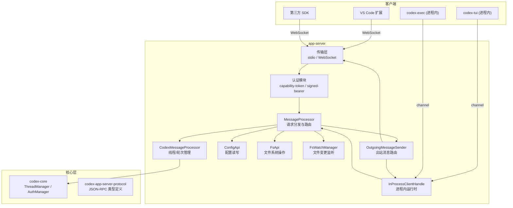

# app-server

## 功能概述

`codex-app-server` 是 Codex 项目的应用服务器 crate，为 IDE 集成（如 VS Code 扩展）和 SDK 客户端提供基于 JSON-RPC 2.0 协议的通信服务。它支持两种传输模式：**stdio**（标准输入输出，适用于进程内嵌入和单客户端场景）和 **WebSocket**（适用于多客户端并发连接场景）。

app-server 是 Codex 架构中连接前端界面与核心引擎的关键中间层，负责：

- 接收并分发来自客户端的 JSON-RPC 请求（线程管理、轮次控制、配置读写等）
- 管理多连接的生命周期与会话状态
- 将 codex-core 引擎产生的事件（通知、请求审批等）路由回对应的客户端连接
- 提供进程内嵌入模式（in-process），允许 TUI 和 exec 在同一进程中直接调用 app-server 功能
- 支持文件系统操作 API、配置管理 API、外部 Agent 配置导入等辅助服务
- 实现优雅关闭与信号重启（graceful restart）机制



## 架构说明

app-server 采用**双循环异步架构**：

1. **处理器循环（Processor Loop）**：接收来自传输层的 `TransportEvent`（连接开启/关闭/消息），将 JSON-RPC 请求解析后交由 `MessageProcessor` 处理。`MessageProcessor` 内部根据请求类型分发给 `CodexMessageProcessor`（线程/轮次管理）、`ConfigApi`（配置操作）、`FsApi`（文件系统）等子处理器。

2. **出站路由循环（Outbound Loop）**：维护所有活跃连接的写端映射，从 `OutgoingMessageSender` 接收待发送消息，根据目标连接 ID 路由到对应的 writer channel。

两个循环通过 `OutboundControlEvent` 枚举保持同步，避免直接共享可变连接状态。

**进程内模式（In-Process）**：`in_process` 模块提供了完整的进程内 app-server 运行时，使用 Tokio channel 替代 socket/stdio 传输，但保留相同的协议语义。TUI 和 exec 通过 `codex-app-server-client` crate 的高级封装调用此运行时。

**传输层**支持三种认证策略：无认证（仅限 loopback）、capability-token（文件共享令牌）、signed-bearer-token（HMAC-SHA256 签名 JWT）。

## 目录结构

```
app-server/
├── src/                        # 主源码目录
│   ├── main.rs                 # 可执行入口，解析命令行参数并启动服务器
│   ├── lib.rs                  # 库入口，定义核心事件循环和服务器生命周期
│   ├── bin/                    # 辅助二进制工具（通知捕获）
│   ├── codex_message_processor/# Codex 消息处理辅助模块（应用列表/插件/OAuth）
│   ├── message_processor/      # 消息处理器测试子模块（追踪传播测试）
│   ├── transport/              # 传输层实现（stdio / WebSocket / 认证）
│   ├── in_process.rs           # 进程内嵌入式运行时（无需进程边界）
│   ├── message_processor.rs    # 核心消息处理器，分发 JSON-RPC 请求
│   ├── codex_message_processor.rs # Codex 业务逻辑处理器（线程/轮次/插件等）
│   ├── outgoing_message.rs     # 出站消息封装与路由
│   ├── bespoke_event_handling.rs # 自定义事件处理逻辑
│   ├── config_api.rs           # 配置读写 API
│   ├── external_agent_config_api.rs # 外部代理配置 API
│   ├── command_exec.rs         # 命令执行管理
│   ├── thread_state.rs         # 线程状态管理
│   ├── thread_status.rs        # 线程状态监控
│   ├── fs_api.rs               # 文件系统 API
│   ├── fs_watch.rs             # 文件系统监控
│   ├── fuzzy_file_search.rs    # 模糊文件搜索
│   ├── filters.rs              # 消息过滤器
│   ├── models.rs               # 模型相关辅助
│   ├── dynamic_tools.rs        # 动态工具管理
│   ├── app_server_tracing.rs   # 分布式追踪辅助
│   ├── error_code.rs           # 错误码定义
│   └── server_request_error.rs # 服务器请求错误处理
├── tests/                      # 集成测试
│   ├── all.rs                  # 测试入口，聚合所有测试模块
│   ├── common/                 # 测试公共基础设施（独立 crate）
│   └── suite/                  # 测试用例集
│       ├── auth.rs             # 认证测试
│       ├── conversation_summary.rs # 对话摘要测试
│       ├── fuzzy_file_search.rs    # 模糊搜索测试
│       └── v2/                 # V2 协议综合测试集（约 50 个测试模块）
└── Cargo.toml                  # crate 配置
```

## 依赖关系

### 内部依赖

| Crate | 用途 |
|---|---|
| `codex-core` | 核心引擎（Config、ThreadManager、AuthManager、OTel 初始化） |
| `codex-app-server-protocol` | JSON-RPC 消息类型定义（ClientRequest、ServerNotification 等） |
| `codex-protocol` | 通用协议类型（SessionSource、ThreadId 等） |
| `codex-exec-server` | 环境管理器（EnvironmentManager） |
| `codex-arg0` | argv0 分发路径解析 |
| `codex-utils-cli` | CLI 配置覆盖解析 |
| `codex-cloud-requirements` | 云端需求加载器 |
| `codex-feedback` | 反馈日志收集 |
| `codex-state` | 状态数据库（SQLite 日志） |
| `codex-login` | 认证与登录 |
| `codex-chatgpt` | ChatGPT 后端连接器 |
| `codex-otel` | OpenTelemetry 集成 |
| `codex-tools` | 工具规格定义 |
| `codex-sandboxing` | 沙箱策略 |
| `codex-file-search` | 文件搜索 |
| `codex-rmcp-client` | RMCP 客户端 |
| `codex-git-utils` | Git 工具 |
| `codex-shell-command` | Shell 命令解析 |
| `codex-features` | 功能标志 |
| `codex-backend-client` | 后端 API 客户端 |
| `codex-utils-absolute-path` | 绝对路径工具 |
| `codex-utils-json-to-toml` | JSON 到 TOML 转换 |
| `codex-utils-pty` | PTY 工具 |

### 主要外部依赖

| Crate | 用途 |
|---|---|
| `axum` | HTTP/WebSocket 服务框架 |
| `tokio` / `tokio-util` | 异步运行时与工具（多线程、信号、通道） |
| `tokio-tungstenite` | WebSocket 协议支持 |
| `serde` / `serde_json` | JSON 序列化/反序列化 |
| `tracing` / `tracing-subscriber` | 结构化日志与可观测性 |
| `clap` | 命令行参数解析 |
| `jsonwebtoken` / `hmac` / `sha2` | JWT 签名验证（WebSocket 认证） |
| `uuid` | UUID v7 生成（连接 ID、请求 ID） |
| `futures` | 异步 Future 组合子 |
| `async-trait` | 异步 trait 支持 |
| `toml` | TOML 配置解析 |

## 核心接口/API

### 公开函数

```rust
/// 以默认 stdio 传输模式启动 app-server
pub async fn run_main(
    arg0_paths: Arg0DispatchPaths,
    cli_config_overrides: CliConfigOverrides,
    loader_overrides: LoaderOverrides,
    default_analytics_enabled: bool,
) -> IoResult<()>

/// 以指定传输模式启动 app-server（支持 stdio 和 WebSocket）
pub async fn run_main_with_transport(
    arg0_paths: Arg0DispatchPaths,
    cli_config_overrides: CliConfigOverrides,
    loader_overrides: LoaderOverrides,
    default_analytics_enabled: bool,
    transport: AppServerTransport,
    session_source: SessionSource,
    auth: AppServerWebsocketAuthSettings,
) -> IoResult<()>
```

### 公开类型

```rust
/// 传输模式枚举
pub enum AppServerTransport {
    Stdio,
    WebSocket { bind_address: SocketAddr },
}

/// WebSocket 认证设置
pub struct AppServerWebsocketAuthSettings { ... }
pub struct AppServerWebsocketAuthArgs { ... }
pub enum WebsocketAuthCliMode { ... }

/// 错误码常量
pub const INPUT_TOO_LARGE_ERROR_CODE: i32;
pub const INVALID_PARAMS_ERROR_CODE: i32;
```

### 进程内运行时（`in_process` 模块）

```rust
/// 进程内启动参数
pub struct InProcessStartArgs { ... }

/// 进程内客户端句柄
pub struct InProcessClientHandle {
    pub async fn request(&self, request: ClientRequest) -> IoResult<...>;
    pub fn notify(&self, notification: ClientNotification) -> IoResult<()>;
    pub fn respond_to_server_request(&self, ...) -> IoResult<()>;
    pub fn fail_server_request(&self, ...) -> IoResult<()>;
    pub async fn next_event(&mut self) -> Option<InProcessServerEvent>;
    pub async fn shutdown(self) -> IoResult<()>;
}

/// 进程内服务器事件
pub enum InProcessServerEvent {
    ServerRequest(ServerRequest),
    ServerNotification(ServerNotification),
    Lagged { skipped: usize },
}
```

### 内部核心类型

```rust
/// 消息处理器（请求分发核心）
struct MessageProcessor {
    async fn process_request(&mut self, ...);
    async fn process_client_request(&mut self, ...);
    async fn connection_closed(&mut self, connection_id);
    async fn shutdown_threads(&self);
}

/// 连接会话状态
struct ConnectionSessionState {
    initialized: bool,
    experimental_api_enabled: bool,
    opted_out_notification_methods: HashSet<String>,
    app_server_client_name: Option<String>,
    client_version: Option<String>,
}
```
