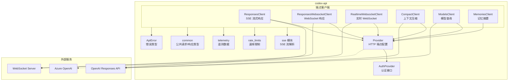

# codex-api

## 功能概述

`codex-api` 是 Codex 项目的 API 客户端 crate，封装了与 OpenAI Responses API 和 Realtime API 的全部通信逻辑。该 crate 提供了多种 API 端点的客户端实现，包括响应生成（SSE 流式和 WebSocket）、上下文压缩（compaction）、模型查询、记忆摘要、实时 WebSocket 会话等。它还处理认证、速率限制、重试策略、遥测等横切关注点。

## 架构说明

## 目录结构

| 文件/目录 | 说明 |
|-----------|------|
| `src/lib.rs` | crate 入口，统一导出公共类型和客户端 |
| `src/common.rs` | 公共请求/响应类型，包括 `ResponsesApiRequest`、`ResponseEvent`、`ResponseStream`、`CompactionInput` 等 |
| `src/provider.rs` | `Provider` 类型 - HTTP 端点配置（base URL、请求头、查询参数、重试策略、超时），包含 Azure 检测逻辑 |
| `src/auth.rs` | `AuthProvider` trait - 认证提供者接口，提供 bearer token 和账户 ID |
| `src/error.rs` | `ApiError` 错误类型枚举（传输错误、API 错误、流错误、上下文窗口超限、配额耗尽、速率限制等） |
| `src/rate_limits.rs` | 速率限制处理 |
| `src/telemetry.rs` | 遥测数据类型（`SseTelemetry`、`WebsocketTelemetry`） |
| `src/sse/` | SSE（Server-Sent Events）流解析模块 |
| `src/requests/` | HTTP 请求构建模块，包括请求头构建 |
| `src/endpoint/` | API 端点客户端实现目录 |
| `src/endpoint/responses.rs` | `ResponsesClient` - SSE 流式响应客户端 |
| `src/endpoint/responses_websocket.rs` | `ResponsesWebsocketClient` - WebSocket 响应客户端 |
| `src/endpoint/realtime_websocket/` | `RealtimeWebsocketClient` - 实时 WebSocket 会话客户端 |
| `src/endpoint/compact.rs` | `CompactClient` - 上下文压缩端点客户端 |
| `src/endpoint/models.rs` | `ModelsClient` - 模型信息查询客户端 |
| `src/endpoint/memories.rs` | `MemoriesClient` - 记忆摘要端点客户端 |
| `src/endpoint/session.rs` | 会话管理端点 |

## 依赖关系

### 内部依赖

| 依赖 crate | 说明 |
|------------|------|
| `codex-protocol` | 核心协议类型（`ResponseItem`、`SandboxPolicy`、`TokenUsage`、`RealtimeEvent` 等） |
| `codex-client` | HTTP 传输层客户端（`Request`、`ReqwestTransport`、`RetryPolicy`、`TransportError`） |
| `codex-utils-rustls-provider` | TLS 提供者工具 |

### 外部依赖

| 依赖 | 说明 |
|------|------|
| `tokio` | 异步运行时（网络、同步、定时器） |
| `tokio-tungstenite` / `tungstenite` | WebSocket 客户端 |
| `futures` | 异步 Stream 支持 |
| `serde` / `serde_json` | JSON 序列化 |
| `http` | HTTP 类型（Method、HeaderMap、StatusCode） |
| `url` | URL 解析 |
| `eventsource-stream` | SSE 流解析 |
| `regex-lite` | 轻量正则 |
| `tokio-util` | 编解码器工具 |
| `bytes` | 字节缓冲区 |
| `thiserror` | 错误派生宏 |
| `async-trait` | 异步 trait 支持 |
| `tracing` | 日志追踪 |

## 核心接口/API

### 端点客户端

- **`ResponsesClient`** - SSE 流式响应客户端，通过 HTTP SSE 调用 OpenAI Responses API，返回 `ResponseStream`
- **`ResponsesWebsocketClient`** / **`ResponsesWebsocketConnection`** - 基于 WebSocket 的响应客户端和连接
- **`RealtimeWebsocketClient`** / **`RealtimeWebsocketConnection`** - 实时 WebSocket 会话客户端（支持音频帧）
- **`RealtimeSessionConfig`** / **`RealtimeSessionMode`** - 实时会话配置
- **`RealtimeEventParser`** - 实时事件解析器
- **`CompactClient`** - 上下文压缩客户端，用于长对话的上下文截断
- **`ModelsClient`** - 模型信息查询客户端
- **`MemoriesClient`** - 记忆摘要客户端

### Provider 配置

- **`Provider`** - HTTP 端点配置，封装 base URL、请求头、查询参数、重试策略和流空闲超时
  - `url_for_path()` - 构建完整请求 URL
  - `build_request()` - 构建 HTTP 请求
  - `websocket_url_for_path()` - 构建 WebSocket URL
  - `is_azure_responses_endpoint()` - 检测是否为 Azure OpenAI 端点
- **`is_azure_responses_wire_base_url()`** - 全局 Azure URL 检测函数

### 认证

- **`AuthProvider`** trait - 认证接口
  - `bearer_token()` - 返回 Bearer token
  - `account_id()` - 返回账户 ID（可选）

### 请求/响应类型

- **`ResponsesApiRequest`** - Responses API 请求结构体（模型、指令、输入、工具、推理配置等）
- **`ResponseCreateWsRequest`** - WebSocket 版本的响应创建请求
- **`CompactionInput`** - 上下文压缩输入
- **`MemorySummarizeInput`** / **`MemorySummarizeOutput`** - 记忆摘要输入/输出
- **`ResponseEvent`** - 响应事件枚举（`Created`、`OutputItemDone`、`Completed`、`OutputTextDelta`、`RateLimits` 等）
- **`ResponseStream`** - 响应事件的异步 Stream 包装

### 错误处理

- **`ApiError`** - API 错误枚举
  - `Transport` - 传输层错误
  - `Api` - HTTP 状态码 + 消息
  - `Stream` - 流处理错误
  - `ContextWindowExceeded` - 上下文窗口超限
  - `QuotaExceeded` - 配额耗尽
  - `Retryable` - 可重试错误
  - `RateLimit` - 速率限制
  - `InvalidRequest` - 无效请求
  - `ServerOverloaded` - 服务器过载

### 遥测

- **`SseTelemetry`** - SSE 请求遥测数据
- **`WebsocketTelemetry`** - WebSocket 请求遥测数据
- **`build_conversation_headers()`** - 构建对话请求头
