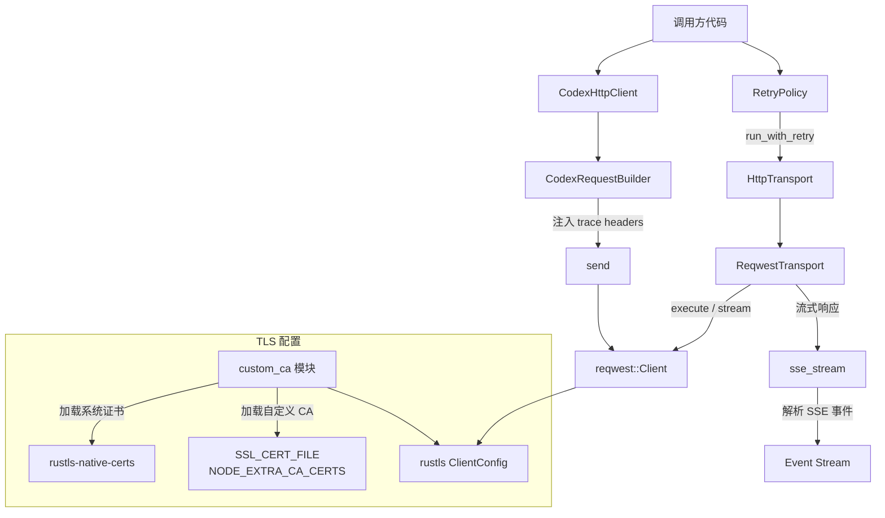

# codex-client

## 功能概述

`codex-client` 是 Codex 项目的 HTTP 客户端库，为整个应用提供统一的网络请求基础设施。它封装了 `reqwest` HTTP 客户端，添加了 OpenTelemetry 分布式追踪传播、自定义 CA 证书支持、请求重试策略、SSE（Server-Sent Events）流式解析和 zstd 请求体压缩等能力。

核心职责：
- 提供带有分布式追踪能力的 HTTP 客户端（`CodexHttpClient` / `CodexRequestBuilder`）
- 支持自定义 CA 证书和企业根证书配置，兼容 `SSL_CERT_FILE`、`NODE_EXTRA_CA_CERTS` 等环境变量
- 实现可配置的请求重试策略（支持 429/5xx/网络错误重试，指数退避+抖动）
- 提供 SSE 流式数据解析器
- 定义统一的 HTTP 传输层抽象（`HttpTransport` trait）
- 支持 zstd 压缩的请求体发送

## 架构说明



## 目录结构

| 文件/目录 | 说明 |
|-----------|------|
| `src/lib.rs` | 库入口，统一导出所有公开类型和函数 |
| `src/default_client.rs` | `CodexHttpClient` 和 `CodexRequestBuilder`，带 OpenTelemetry trace header 注入 |
| `src/transport.rs` | `HttpTransport` trait 定义和 `ReqwestTransport` 实现，支持普通请求和流式请求 |
| `src/custom_ca.rs` | 自定义 CA 证书加载和 TLS 配置（核心文件，约 900 行） |
| `src/retry.rs` | 请求重试策略（指数退避、抖动、可配置重试条件） |
| `src/sse.rs` | SSE（Server-Sent Events）流式数据解析和转发 |
| `src/error.rs` | 错误类型定义（`TransportError`、`StreamError`） |
| `src/request.rs` | HTTP 请求和响应的基础类型定义 |
| `src/telemetry.rs` | 请求遥测数据类型 |
| `src/bin/` | 辅助二进制工具（CA 探测测试用） |

## 依赖关系

### 内部依赖

| 依赖 crate | 用途 |
|------------|------|
| `codex-utils-rustls-provider` | Rustls TLS 提供者配置 |

### 外部依赖

| 依赖 | 用途 |
|------|------|
| `reqwest` | HTTP 客户端底层实现（JSON 支持、流式响应） |
| `rustls` / `rustls-native-certs` / `rustls-pki-types` | TLS 配置、系统原生证书加载 |
| `http` | HTTP 标准类型（`HeaderMap`、`Method`、`StatusCode`） |
| `futures` | 异步 Stream 处理 |
| `bytes` | 高效字节缓冲区 |
| `eventsource-stream` | SSE 事件流解析 |
| `opentelemetry` / `tracing-opentelemetry` | 分布式追踪传播 |
| `tokio` | 异步运行时（定时器、同步原语） |
| `rand` | 随机数生成（重试抖动） |
| `serde` / `serde_json` | 序列化/反序列化 |
| `thiserror` | 错误类型派生 |
| `zstd` | zstd 压缩算法（请求体压缩） |

## 核心接口/API

### HTTP 客户端

```rust
/// 带分布式追踪的 HTTP 客户端
#[derive(Clone, Debug)]
pub struct CodexHttpClient {
    inner: reqwest::Client,
}

impl CodexHttpClient {
    pub fn new(inner: reqwest::Client) -> Self;
    pub fn get<U: IntoUrl>(&self, url: U) -> CodexRequestBuilder;
    pub fn post<U: IntoUrl>(&self, url: U) -> CodexRequestBuilder;
    pub fn request<U: IntoUrl>(&self, method: Method, url: U) -> CodexRequestBuilder;
}

/// 请求构建器（自动注入 OpenTelemetry trace headers）
pub struct CodexRequestBuilder { ... }

impl CodexRequestBuilder {
    pub fn headers(self, headers: HeaderMap) -> Self;
    pub fn header<K, V>(self, key: K, value: V) -> Self;
    pub fn bearer_auth<T: Display>(self, token: T) -> Self;
    pub fn timeout(self, timeout: Duration) -> Self;
    pub fn json<T: Serialize>(self, value: &T) -> Self;
    pub fn body<B: Into<Body>>(self, body: B) -> Self;
    pub async fn send(self) -> Result<Response, reqwest::Error>;
}
```

### 传输层抽象

```rust
/// HTTP 传输层 trait
#[async_trait]
pub trait HttpTransport: Send + Sync {
    async fn execute(&self, req: Request) -> Result<Response, TransportError>;
    async fn stream(&self, req: Request) -> Result<StreamResponse, TransportError>;
}

/// 基于 reqwest 的传输层实现（支持 zstd 压缩）
pub struct ReqwestTransport { ... }

/// 流式响应
pub struct StreamResponse {
    pub status: StatusCode,
    pub headers: HeaderMap,
    pub bytes: ByteStream,
}

pub type ByteStream = BoxStream<'static, Result<Bytes, TransportError>>;
```

### 自定义 CA

```rust
/// 构建带自定义 CA 证书的 reqwest 客户端
pub fn build_reqwest_client_with_custom_ca(
    builder: reqwest::ClientBuilder,
) -> io::Result<reqwest::Client>;

/// 构建带自定义 CA 的 rustls 客户端配置
pub fn maybe_build_rustls_client_config_with_custom_ca() -> Option<rustls::ClientConfig>;

pub struct BuildCustomCaTransportError;
```

### 重试策略

```rust
/// 重试策略配置
pub struct RetryPolicy {
    pub max_attempts: u64,
    pub base_delay: Duration,
    pub retry_on: RetryOn,
}

/// 重试条件
pub struct RetryOn {
    pub retry_429: bool,        // 是否重试 429 Too Many Requests
    pub retry_5xx: bool,        // 是否重试 5xx 服务器错误
    pub retry_transport: bool,  // 是否重试网络/超时错误
}

/// 执行带重试的请求
pub async fn run_with_retry<T, F, Fut>(
    policy: RetryPolicy,
    make_req: impl FnMut() -> Request,
    op: F,
) -> Result<T, TransportError>;

/// 计算指数退避延迟（带随机抖动）
pub fn backoff(base: Duration, attempt: u64) -> Duration;
```

### SSE 流

```rust
/// 启动 SSE 流解析任务
pub fn sse_stream(
    stream: ByteStream,
    idle_timeout: Duration,
    tx: mpsc::Sender<Result<String, StreamError>>,
);
```

### 错误类型

```rust
pub enum TransportError {
    Http { status, url, headers, body },  // HTTP 错误响应
    RetryLimit,                           // 重试次数耗尽
    Timeout,                              // 请求超时
    Network(String),                      // 网络错误
    Build(String),                        // 请求构建错误
}

pub enum StreamError {
    Stream(String),  // 流处理错误
    Timeout,         // 流空闲超时
}
```

### 请求/响应类型

```rust
pub struct Request {
    pub method: String,
    pub url: String,
    pub headers: HeaderMap,
    pub body: Option<Value>,
    pub compression: RequestCompression,
    pub timeout: Option<Duration>,
}

pub enum RequestCompression {
    None,
    Zstd,
}

pub struct Response {
    pub status: StatusCode,
    pub headers: HeaderMap,
    pub body: Bytes,
}

/// 请求遥测信息
pub struct RequestTelemetry { ... }
```
