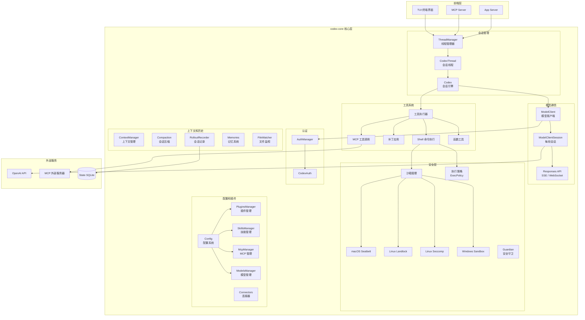
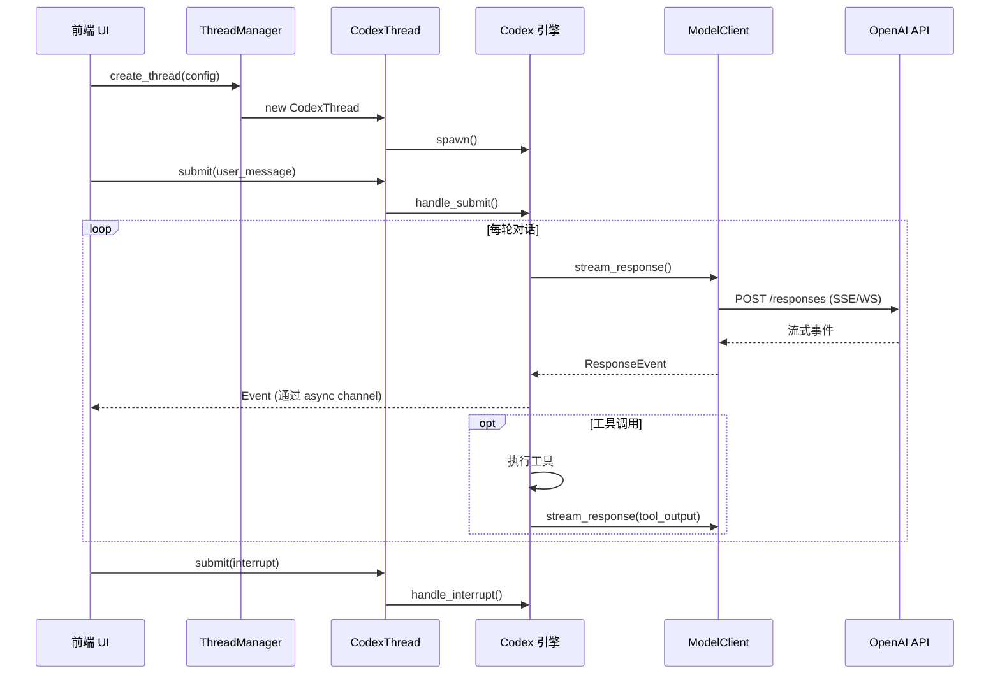

# core

## 功能概述

`codex-core` 是 Codex 项目中最核心、最庞大的 crate，实现了 AI 编码助手的全部核心业务逻辑。它是连接前端 UI（TUI/MCP/App Server）和后端 AI 模型 API 之间的中枢，负责会话管理、模型通信、工具执行、安全沙箱、配置管理、插件系统等所有关键功能。

核心职责：
- **会话管理**：通过 `ThreadManager` 和 `CodexThread` 管理 AI 对话的完整生命周期
- **模型通信**：通过 `ModelClient` / `ModelClientSession` 与 OpenAI Responses API 通信（支持 SSE 和 WebSocket）
- **工具执行**：Shell 命令执行、文件补丁应用、MCP 工具调用
- **安全沙箱**：跨平台沙箱实现（macOS Seatbelt、Linux Landlock/Seccomp、Windows Sandbox）
- **执行策略**：基于 TOML 规则文件的命令执行权限控制
- **配置系统**：分层配置加载（默认值 -> 配置文件 -> CLI 覆盖）
- **认证集成**：通过 `codex-login` 提供统一的认证管理
- **插件和技能**：MCP 插件管理、Skills 系统、Connectors 集成
- **可观测性**：OpenTelemetry 初始化、指标收集、结构化日志
- **会话持久化**：Rollout 文件记录、会话恢复和压缩（compaction）
- **上下文管理**：智能上下文注入、自动压缩、文件监视

## 架构说明



### 会话生命周期



## 目录结构

| 文件/目录 | 说明 |
|-----------|------|
| **核心会话** | |
| `src/lib.rs` | 库入口，导出所有公开模块和类型（约 210 行模块声明和 re-export） |
| `src/codex.rs` | `Codex` 会话引擎核心实现（最核心的文件之一） |
| `src/codex_thread.rs` | `CodexThread` -- 单个对话线程的封装 |
| `src/thread_manager.rs` | `ThreadManager` -- 管理所有活跃对话线程 |
| `src/codex_delegate.rs` | Codex 委托模式实现 |
| **模型通信** | |
| `src/client.rs` | `ModelClient` / `ModelClientSession` -- 与 AI 模型 API 的通信层（约 1800 行） |
| `src/client_common.rs` | 客户端公共类型（`Prompt`、`ResponseEvent`、`ResponseStream`） |
| `src/api_bridge.rs` | API 桥接层，连接 codex-api 和 core 认证 |
| `src/realtime_context.rs` | 实时上下文管理 |
| `src/realtime_conversation.rs` | 实时对话管理（音频/文本） |
| **配置系统** | |
| `src/config.rs` | 配置模块入口 |
| `src/config_loader.rs` | 配置加载器 |
| `src/external_agent_config.rs` | 外部 Agent 配置 |
| `src/flags.rs` | 功能标志 |
| **工具执行** | |
| `src/tools.rs` | 工具定义和注册 |
| `src/unified_exec.rs` | 统一执行框架 |
| `src/function_tool.rs` | 函数工具实现 |
| `src/user_shell_command.rs` | 用户 Shell 命令处理 |
| `src/apply_patch.rs` | 文件补丁应用 |
| `src/command_canonicalization.rs` | 命令规范化 |
| **安全和策略** | |
| `src/sandboxing.rs` | 沙箱管理接口 |
| `src/seatbelt.rs` | macOS Seatbelt 沙箱 |
| `src/landlock.rs` | Linux Landlock 沙箱 |
| `src/windows_sandbox.rs` | Windows 沙箱 |
| `src/exec_policy.rs` | 执行策略管理 |
| `src/guardian.rs` | 安全守卫模块 |
| `src/safety.rs` | 安全检查 |
| `src/sandbox_tags.rs` | 沙箱标签 |
| **MCP 和插件** | |
| `src/mcp.rs` | MCP 管理入口 |
| `src/mcp_connection_manager.rs` | MCP 连接管理器 |
| `src/mcp_tool_call.rs` | MCP 工具调用 |
| `src/mcp_tool_approval_templates.rs` | MCP 工具审批模板 |
| `src/plugins.rs` | 插件系统 |
| `src/skills.rs` | 技能系统 |
| `src/skills_watcher.rs` | 技能文件监视 |
| `src/connectors.rs` | 连接器集成 |
| **上下文和历史** | |
| `src/context_manager.rs` | 上下文管理器 |
| `src/contextual_user_message.rs` | 上下文化用户消息 |
| `src/compact.rs` | 会话压缩（本地） |
| `src/compact_remote.rs` | 会话压缩（远程） |
| `src/memories.rs` | 记忆系统 |
| `src/mention_syntax.rs` | @mention 语法解析 |
| `src/message_history.rs` | 消息历史管理 |
| **会话持久化** | |
| `src/rollout.rs` | Rollout 会话记录器 |
| `src/state.rs` | 状态管理 |
| `src/state_db_bridge.rs` | 状态数据库桥接 |
| `src/tasks.rs` | 任务管理 |
| **模型和提供商** | |
| `src/model_provider_info.rs` | 模型提供商信息（OpenAI、Ollama、LM Studio） |
| `src/models_manager.rs` | 模型管理器 |
| **Agent** | |
| `src/agent/` | Agent 子系统 |
| `src/arc_monitor.rs` | Arc 引用计数监控 |
| **应用** | |
| `src/apps/` | 应用层集成 |
| **可观测性** | |
| `src/otel_init.rs` | OpenTelemetry 初始化 |
| `src/auth_env_telemetry.rs` | 认证环境遥测 |
| `src/turn_timing.rs` | 对话轮次计时 |
| `src/turn_metadata.rs` | 轮次元数据 |
| `src/memory_trace.rs` | 内存追踪 |
| **工具和辅助** | |
| `src/utils.rs` | 通用工具函数 |
| `src/util.rs` | 辅助工具 |
| `src/shell.rs` | Shell 检测和配置 |
| `src/shell_detect.rs` | Shell 类型检测 |
| `src/shell_snapshot.rs` | Shell 环境快照 |
| `src/environment_context.rs` | 环境上下文 |
| `src/text_encoding.rs` | 文本编码检测和转换 |
| `src/file_watcher.rs` | 文件变更监视 |
| `src/event_mapping.rs` | 事件映射 |
| `src/stream_events_utils.rs` | 流式事件工具 |
| `src/response_debug_context.rs` | 响应调试上下文 |
| `src/review_format.rs` | 代码审查格式化 |
| `src/review_prompts.rs` | 代码审查提示词 |
| `src/web_search.rs` | Web 搜索集成 |
| `src/project_doc.rs` | 项目文档 |
| `src/personality_migration.rs` | 个性化迁移 |
| `src/turn_diff_tracker.rs` | 轮次差异追踪 |
| `src/commit_attribution.rs` | 提交署名 |
| `src/session_prefix.rs` | 会话前缀 |
| `src/session_startup_prewarm.rs` | 会话预热 |
| `src/network_policy_decision.rs` | 网络策略决策 |
| `src/network_proxy_loader.rs` | 网络代理加载 |
| `src/original_image_detail.rs` | 图片原始细节 |
| `src/default_client_forwarding.rs` | 默认客户端转发 |
| `src/bin/` | 辅助二进制工具 |
| `src/bin/config_schema.rs` | 配置 JSON Schema 生成工具 |
| `src/test_support.rs` | 测试支持工具 |

## 依赖关系

### 内部依赖

`codex-core` 是依赖最多的 crate，它整合了几乎所有其他 Codex 子 crate：

| 依赖 crate | 用途 |
|------------|------|
| `codex-login` (as `auth`) | 认证管理（`AuthManager`、`CodexAuth`） |
| `codex-api` | OpenAI Responses API 客户端 |
| `codex-protocol` | 协议类型定义（事件、消息、配置类型） |
| `codex-config` | 配置文件解析 |
| `codex-state` | 状态持久化（SQLite） |
| `codex-analytics` | 分析事件客户端 |
| `codex-tools` | 工具定义和 Schema 生成 |
| `codex-connectors` | 外部连接器集成 |
| `codex-core-skills` | 核心技能定义 |
| `codex-plugin` | 插件系统 |
| `codex-hooks` | Hook 事件系统 |
| `codex-instructions` | 指令管理 |
| `codex-sandboxing` | 沙箱平台抽象 |
| `codex-execpolicy` | 执行策略引擎 |
| `codex-exec-server` | 命令执行服务 |
| `codex-shell-command` | Shell 命令解析和安全检查 |
| `codex-features` | 功能特性开关 |
| `codex-rollout` | Rollout 记录 |
| `codex-otel` | OpenTelemetry 集成 |
| `codex-network-proxy` | 网络代理 |
| `codex-rmcp-client` | MCP 客户端 |
| `codex-git-utils` | Git 工具 |
| `codex-apply-patch` | 补丁应用引擎 |
| `codex-code-mode` | 代码模式 |
| `codex-async-utils` | 异步工具 |
| `codex-secrets` | 密钥管理 |
| `codex-terminal-detection` | 终端检测 |
| `codex-app-server-protocol` | App Server 协议 |
| `codex-utils-*` | 各种工具库（路径、图片、缓存、PTY、模板等） |

### 外部依赖（主要）

| 依赖 | 用途 |
|------|------|
| `tokio` | 异步运行时（多线程、进程管理、信号处理） |
| `serde` / `serde_json` / `toml` | 序列化/反序列化 |
| `reqwest` | HTTP 客户端 |
| `rmcp` | MCP 协议实现 |
| `anyhow` / `thiserror` | 错误处理 |
| `chrono` | 日期时间处理 |
| `uuid` | UUID 生成 |
| `regex-lite` | 正则表达式 |
| `similar` | 文本差异比较 |
| `notify` | 文件系统监视 |
| `image` | 图片处理（JPEG/PNG/WebP） |
| `bm25` | BM25 文本检索算法 |
| `tempfile` | 临时文件管理 |
| `which` | 可执行文件查找 |
| `wildmatch` | 通配符匹配 |
| `zip` | ZIP 压缩/解压 |
| `url` | URL 解析 |
| `indexmap` | 有序 HashMap |
| `csv` | CSV 解析 |
| `encoding_rs` / `chardetng` | 字符编码检测和转换 |
| `landlock` | Linux Landlock 沙箱（Linux only） |
| `seccompiler` | Linux Seccomp 过滤器（Linux only） |
| `core-foundation` | macOS 核心框架（macOS only） |

## 核心接口/API

### 会话管理

```rust
/// 线程管理器 -- 管理所有活跃的对话线程
pub struct ThreadManager { ... }

impl ThreadManager {
    /// 创建新的线程管理器
    pub fn new(
        config: &Config,
        auth_manager: AuthManager,
        session_source: SessionSource,
        collaboration_modes: CollaborationModesConfig,
        environment_manager: Arc<EnvironmentManager>,
    ) -> Self;

    /// 获取已有线程
    pub async fn get_thread(&self, thread_id: ThreadId) -> Result<Arc<CodexThread>>;
}

/// 单个对话线程
pub struct CodexThread { ... }

impl CodexThread {
    /// 向会话提交操作
    pub async fn submit_with_id(&self, submission: Submission) -> Result<()>;
}

/// 线程配置快照
pub struct ThreadConfigSnapshot { ... }

/// 新线程参数
pub struct NewThread { ... }

/// 分叉快照
pub struct ForkSnapshot { ... }
```

### 模型客户端

```rust
/// 模型客户端 -- 管理与 AI 模型的通信
pub struct ModelClient { ... }

/// 每轮对话的客户端会话
pub struct ModelClientSession { ... }

/// 客户端公共类型
pub struct Prompt { ... }
pub struct ResponseEvent { ... }
pub struct ResponseStream { ... }
pub const REVIEW_PROMPT: &str;
```

### 配置系统

```rust
/// 配置模块（pub mod config）
pub struct Config { ... }
pub struct ConfigOverrides { ... }
pub struct ConfigBuilder { ... }

impl Config {
    pub async fn load_with_cli_overrides(overrides: Vec<(String, toml::Value)>) -> io::Result<Config>;
    pub async fn load_with_cli_overrides_and_harness_overrides(
        cli_overrides: Vec<(String, toml::Value)>,
        harness_overrides: ConfigOverrides,
    ) -> io::Result<Config>;
}
```

### 安全和沙箱

```rust
/// 获取平台沙箱实现
pub fn get_platform_sandbox() -> impl Sandbox;

/// 执行策略
pub fn load_exec_policy(...) -> Result<ExecPolicy>;
pub fn check_execpolicy_for_warnings(...) -> ...;

/// MCP 沙箱状态
pub struct SandboxState { ... }
pub const MCP_SANDBOX_STATE_CAPABILITY: &str;
pub const MCP_SANDBOX_STATE_METHOD: &str;
```

### MCP 集成

```rust
/// MCP 模块（pub mod mcp）
pub struct McpManager { ... }
```

### 模型提供商

```rust
/// 模型提供商信息
pub struct ModelProviderInfo { ... }

/// Wire API 类型
pub enum WireApi { ... }

/// 内置提供商
pub fn built_in_model_providers() -> Vec<ModelProviderInfo>;
pub fn create_oss_provider_with_base_url(...) -> ModelProviderInfo;

pub const OPENAI_PROVIDER_ID: &str;
pub const OLLAMA_OSS_PROVIDER_ID: &str;
pub const LMSTUDIO_OSS_PROVIDER_ID: &str;
pub const DEFAULT_OLLAMA_PORT: u16;
pub const DEFAULT_LMSTUDIO_PORT: u16;
```

### 会话持久化

```rust
/// Rollout 记录器
pub struct RolloutRecorder { ... }
pub struct RolloutRecorderParams { ... }
pub struct SessionMeta { ... }

/// 会话查找
pub fn find_thread_path_by_id_str(...) -> ...;
pub fn find_thread_path_by_name_str(...) -> ...;
pub fn find_thread_name_by_id(...) -> ...;
pub fn find_archived_thread_path_by_id_str(...) -> ...;

/// 会话列表
pub struct ThreadItem { ... }
pub struct ThreadsPage { ... }
pub enum ThreadSortKey { ... }
pub struct Cursor { ... }

/// 事件持久化模式
pub enum EventPersistenceMode { ... }

pub const SESSIONS_SUBDIR: &str;
pub const ARCHIVED_SESSIONS_SUBDIR: &str;
```

### 可观测性

```rust
/// OpenTelemetry 初始化（pub mod otel_init）
pub fn build_provider(config: &Config, version: &str, service_name: Option<&str>, analytics_enabled: bool) -> ...;

/// 分析事件客户端
pub use codex_analytics::AnalyticsEventsClient;

/// 轮次元数据
pub fn build_turn_metadata_header(...) -> ...;
```

### 认证（re-export from codex-login）

```rust
pub use codex_login as auth;
pub use auth::AuthManager;
pub use auth::CodexAuth;
```

### 工具和辅助

```rust
/// 文本编码
pub fn bytes_to_string_smart(bytes: &[u8]) -> String;

/// 路径工具
pub use codex_utils_path::env;
pub use utils::path_utils;

/// 工具 Schema 解析
pub use codex_tools::parse_tool_input_schema;

/// 会话压缩
pub use compact::content_items_to_text;

/// 文件监视
pub struct FileWatcherEvent { ... }
```
