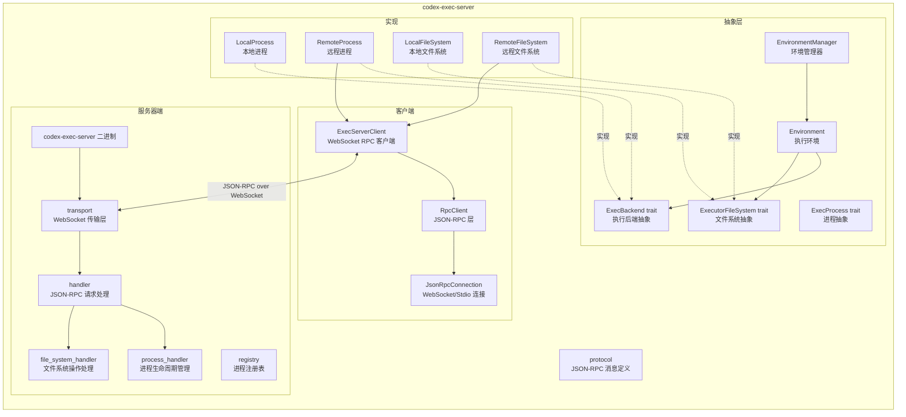

# exec-server

## 功能概述

`codex-exec-server` 是 Codex 项目的执行服务器 crate，提供了一个基于 JSON-RPC over WebSocket 的进程执行和文件系统操作服务。它既包含服务器端实现（可作为独立二进制运行），也包含客户端库，使 Codex 核心能够在本地或远程环境中执行命令、管理进程生命周期以及进行文件系统操作。该 crate 通过 `Environment` 和 `EnvironmentManager` 抽象了本地执行和远程执行的差异，提供统一的 `ExecBackend` 和 `ExecutorFileSystem` 接口。

## 架构说明

## 目录结构

| 文件/目录 | 说明 |
|-----------|------|
| `src/lib.rs` | crate 入口，导出全部公共类型和模块 |
| `src/bin/codex-exec-server.rs` | 可执行二进制入口 |
| `src/protocol.rs` | JSON-RPC 协议消息定义 - 方法名常量、请求/响应/通知结构体（`ExecParams`、`ReadResponse`、`WriteParams` 等） |
| `src/server.rs` | 服务器入口模块，导出 `run_main()` 和 `DEFAULT_LISTEN_URL` |
| `src/server/transport.rs` | WebSocket 传输层服务器 |
| `src/server/handler.rs` | JSON-RPC 请求处理器（路由请求到对应处理函数） |
| `src/server/process_handler.rs` | 进程生命周期处理（启动、读取输出、写入输入、终止） |
| `src/server/file_system_handler.rs` | 文件系统操作处理（读文件、写文件、创建目录、获取元数据、列目录、删除、复制） |
| `src/server/processor.rs` | 请求处理器 |
| `src/server/registry.rs` | 服务器端进程注册表 |
| `src/client.rs` | `ExecServerClient` - WebSocket RPC 客户端，包含会话管理和通知分发 |
| `src/client_api.rs` | 客户端连接选项类型 `ExecServerClientConnectOptions`、`RemoteExecServerConnectArgs` |
| `src/connection.rs` | `JsonRpcConnection` - WebSocket 或 Stdio 的 JSON-RPC 连接抽象 |
| `src/rpc.rs` | `RpcClient` - JSON-RPC 层，管理请求 ID 和回调 |
| `src/environment.rs` | `Environment` / `EnvironmentManager` - 执行环境抽象，统一本地和远程执行 |
| `src/process.rs` | `ExecProcess` / `ExecBackend` trait - 进程执行抽象接口 |
| `src/process_id.rs` | `ProcessId` - 进程标识类型（协议层面的逻辑 ID，非操作系统 PID） |
| `src/file_system.rs` | `ExecutorFileSystem` trait - 文件系统操作抽象接口 |
| `src/local_process.rs` | `LocalProcess` - 本地进程执行实现（PTY 支持） |
| `src/remote_process.rs` | `RemoteProcess` - 通过 exec-server 远程执行进程 |
| `src/local_file_system.rs` | `LocalFileSystem` - 本地文件系统实现 |
| `src/remote_file_system.rs` | `RemoteFileSystem` - 通过 exec-server 远程文件系统操作 |

## 依赖关系

### 内部依赖

| 依赖 crate | 说明 |
|------------|------|
| `codex-app-server-protocol` | 应用服务器协议类型（`JSONRPCMessage`、`JSONRPCNotification`、文件系统操作类型） |
| `codex-utils-absolute-path` | 绝对路径工具 |
| `codex-utils-pty` | PTY（伪终端）支持 |

### 外部依赖

| 依赖 | 说明 |
|------|------|
| `tokio` | 异步运行时（文件 I/O、网络、进程、同步） |
| `tokio-tungstenite` | WebSocket 服务器/客户端 |
| `serde` / `serde_json` | JSON 序列化 |
| `clap` | 命令行参数解析（用于二进制） |
| `arc-swap` | 无锁原子引用交换（用于会话注册表） |
| `base64` | Base64 编解码（进程输出传输） |
| `futures` | 异步流支持 |
| `thiserror` | 错误派生宏 |
| `async-trait` | 异步 trait 支持 |
| `tracing` | 日志追踪 |

## 核心接口/API

### 服务器

- **`run_main()`** / **`run_main_with_listen_url()`** - 启动执行服务器，监听 WebSocket 连接
- **`DEFAULT_LISTEN_URL`** - 默认监听地址

### 客户端

- **`ExecServerClient`** - WebSocket RPC 客户端
  - `connect_websocket()` - 连接到远程执行服务器
  - `exec()` - 启动远程进程
  - `read()` - 读取进程输出
  - `write()` - 向进程写入输入
  - `terminate()` - 终止进程
  - `fs_read_file()` / `fs_write_file()` / `fs_create_directory()` / `fs_get_metadata()` / `fs_read_directory()` / `fs_remove()` / `fs_copy()` - 文件系统操作
- **`ExecServerError`** - 客户端错误枚举（`Spawn`、`WebSocketConnectTimeout`、`InitializeTimedOut`、`Closed`、`Protocol`、`Server` 等）

### 执行抽象

- **`ExecBackend`** trait - 执行后端接口
  - `start()` - 启动进程，返回 `StartedExecProcess`
- **`ExecProcess`** trait - 进程操作接口
  - `process_id()` - 获取进程 ID
  - `subscribe_wake()` - 订阅进程状态变更通知
  - `read()` - 读取输出
  - `write()` - 写入输入
  - `terminate()` - 终止进程

### 文件系统抽象

- **`ExecutorFileSystem`** trait - 文件系统操作接口
  - `read_file()` / `write_file()` / `create_directory()` / `get_metadata()` / `read_directory()` / `remove()` / `copy()`

### 环境管理

- **`Environment`** - 执行环境，统一本地/远程执行
  - `create()` - 创建环境（自动检测远程 exec-server）
  - `get_exec_backend()` - 获取执行后端
  - `get_filesystem()` - 获取文件系统实例
- **`EnvironmentManager`** - 环境管理器（懒加载、缓存）
  - `from_env()` - 从环境变量 `CODEX_EXEC_SERVER_URL` 创建
  - `current()` - 获取当前环境（异步初始化，单次创建）

### 协议类型

- **`ProcessId`** - 进程标识（客户端选择的逻辑 ID）
- **`ExecParams`** - 进程启动参数（进程 ID、argv、cwd、env、tty、arg0）
- **`ReadResponse`** - 读取响应（输出块、序列号、退出状态）
- **`WriteStatus`** - 写入状态（`Accepted`、`UnknownProcess`、`StdinClosed`、`Starting`）
- **`ExecOutputStream`** - 输出流类型（`Stdout`、`Stderr`、`Pty`）
- 通知类型：`ExecOutputDeltaNotification`、`ExecExitedNotification`、`ExecClosedNotification`
