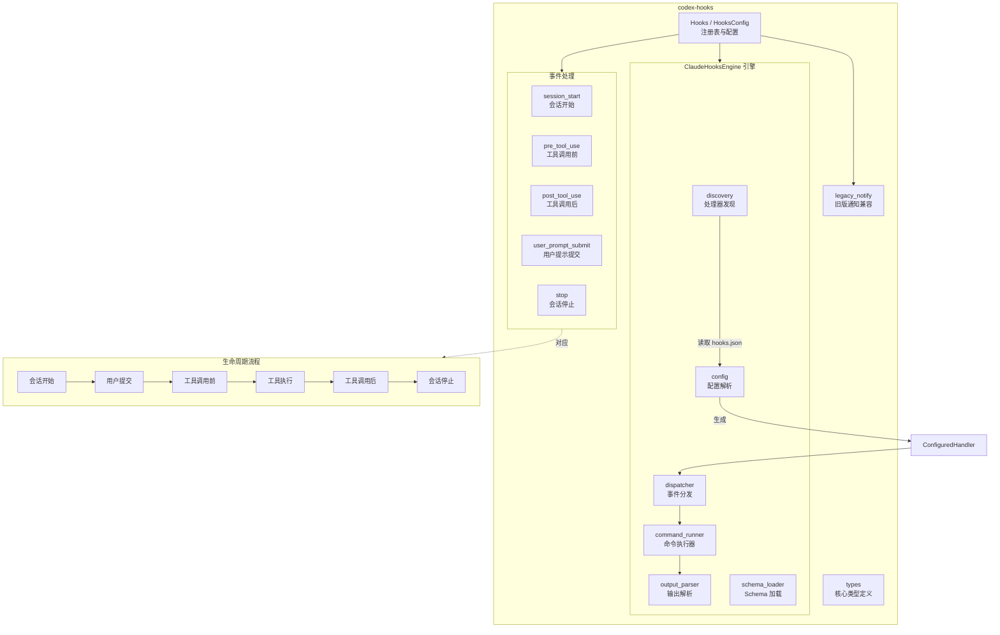

# hooks

## 功能概述

`codex-hooks` 是 Codex 项目的钩子（Hook）系统 crate，提供了会话生命周期事件的可扩展回调机制。该 crate 允许用户通过配置文件（`hooks.json`）注册自定义命令，在特定生命周期事件（如会话开始、工具调用前后、用户提交提示词、会话停止）触发时自动执行。钩子系统支持事件匹配过滤、超时控制、状态消息展示，并且能够影响执行流程（如阻止工具调用、注入提示词）。它同时兼容旧版的 `notify` 命令行回调机制。

## 架构说明

## 目录结构

| 文件/目录 | 说明 |
|-----------|------|
| `src/lib.rs` | crate 入口，导出所有公共类型和函数 |
| `src/registry.rs` | `Hooks` 注册表和 `HooksConfig` 配置 - 统一入口，将事件分发到引擎和旧版通知 |
| `src/types.rs` | 核心类型定义 - `Hook`、`HookFn`、`HookPayload`、`HookEvent`、`HookResult`、`HookResponse`、`HookToolKind`、`HookToolInput` 等 |
| `src/legacy_notify.rs` | 旧版 `notify` 命令回调兼容层（`legacy_notify_json()`、`notify_hook()`） |
| `src/schema.rs` | JSON Schema fixture 生成 |
| `src/user_notification.rs` | 用户通知相关 |
| `src/engine/` | ClaudeHooksEngine 引擎实现目录 |
| `src/engine/mod.rs` | 引擎入口 - `ClaudeHooksEngine`、`ConfiguredHandler`、`CommandShell` 类型定义 |
| `src/engine/discovery.rs` | 处理器发现 - 从 `ConfigLayerStack` 中发现和加载 hook 处理器 |
| `src/engine/config.rs` | 配置解析 - 解析 `hooks.json` 配置 |
| `src/engine/dispatcher.rs` | 事件分发器 - 将事件匹配到对应的处理器并执行 |
| `src/engine/command_runner.rs` | 命令执行器 - 通过 shell 执行 hook 命令 |
| `src/engine/output_parser.rs` | 输出解析器 - 解析 hook 命令的 stdout 输出（JSON 格式） |
| `src/engine/schema_loader.rs` | Schema 加载器 - 加载和缓存生成的 hook schema |
| `src/events/` | 事件处理模块目录 |
| `src/events/mod.rs` | 事件模块入口 |
| `src/events/common.rs` | 事件处理公共逻辑 |
| `src/events/session_start.rs` | 会话开始事件处理 |
| `src/events/pre_tool_use.rs` | 工具调用前事件处理 |
| `src/events/post_tool_use.rs` | 工具调用后事件处理 |
| `src/events/user_prompt_submit.rs` | 用户提示提交事件处理 |
| `src/events/stop.rs` | 会话停止事件处理 |
| `src/bin/` | 二进制工具目录 |

## 依赖关系

### 内部依赖

| 依赖 crate | 说明 |
|------------|------|
| `codex-protocol` | 协议类型（`ThreadId`、`HookRunSummary`、`HookEventName`、`SandboxPermissions`） |
| `codex-config` | 配置层栈 `ConfigLayerStack`（用于发现 hooks.json 配置） |

### 外部依赖

| 依赖 | 说明 |
|------|------|
| `tokio` | 异步运行时（进程执行、I/O、定时器） |
| `futures` | 异步组合器 |
| `serde` / `serde_json` | JSON 序列化/反序列化 |
| `schemars` | JSON Schema 生成 |
| `regex` | 正则表达式匹配（hook 事件过滤） |
| `chrono` | 日期时间处理（`triggered_at` 时间戳） |
| `anyhow` | 错误处理 |

## 核心接口/API

### 注册表

- **`Hooks`** - 钩子注册表（核心入口）
  - `new(config)` - 从 `HooksConfig` 创建注册表
  - `startup_warnings()` - 获取启动时的警告信息
  - `dispatch(payload)` - 分发旧版 hook 事件
  - `preview_session_start()` / `run_session_start()` - 预览/执行会话开始 hook
  - `preview_pre_tool_use()` / `run_pre_tool_use()` - 预览/执行工具调用前 hook
  - `preview_post_tool_use()` / `run_post_tool_use()` - 预览/执行工具调用后 hook
  - `preview_user_prompt_submit()` / `run_user_prompt_submit()` - 预览/执行用户提示提交 hook
  - `preview_stop()` / `run_stop()` - 预览/执行会话停止 hook
- **`HooksConfig`** - 钩子配置
  - `legacy_notify_argv` - 旧版 notify 命令参数
  - `feature_enabled` - 是否启用 hooks.json 功能
  - `config_layer_stack` - 配置层栈（用于发现 hooks.json）
  - `shell_program` / `shell_args` - hook 命令执行使用的 shell

### 事件请求/结果类型

- **`SessionStartRequest`** / **`SessionStartOutcome`** - 会话开始事件请求和结果
- **`PreToolUseRequest`** / **`PreToolUseOutcome`** - 工具调用前事件请求和结果
- **`PostToolUseRequest`** / **`PostToolUseOutcome`** - 工具调用后事件请求和结果
- **`UserPromptSubmitRequest`** / **`UserPromptSubmitOutcome`** - 用户提示提交事件请求和结果
- **`StopRequest`** / **`StopOutcome`** - 会话停止事件请求和结果
- **`SessionStartSource`** - 会话开始来源

### 核心类型

- **`Hook`** - 钩子定义（名称 + 异步回调函数）
  - `execute(payload)` - 执行钩子，返回 `HookResponse`
- **`HookFn`** - 钩子回调函数类型签名 `Arc<dyn Fn(&HookPayload) -> BoxFuture<HookResult>>`
- **`HookPayload`** - 钩子载荷（会话 ID、工作目录、客户端信息、触发时间、事件数据）
- **`HookEvent`** - 钩子事件枚举
  - `AfterAgent` - Agent 完成后（包含线程 ID、轮次 ID、输入消息、最后助手消息）
  - `AfterToolUse` - 工具使用后（包含调用 ID、工具名称、工具类型、输入、执行结果等）
- **`HookResult`** - 钩子执行结果
  - `Success` - 成功
  - `FailedContinue` - 失败但继续执行后续 hook
  - `FailedAbort` - 失败且中止后续 hook
- **`HookResponse`** - 钩子响应（hook 名称 + 执行结果）
- **`HookToolKind`** - 工具类型枚举：`Function`、`Custom`、`LocalShell`、`Mcp`
- **`HookToolInput`** - 工具输入枚举：`Function`、`Custom`、`LocalShell`（含命令、工作目录、超时、沙箱权限）、`Mcp`

### 引擎内部

- **`ClaudeHooksEngine`** - hooks.json 引擎（处理器发现、事件匹配、命令执行、输出解析）
- **`ConfiguredHandler`** - 已配置的处理器（事件名称、匹配器、命令、超时、状态消息、来源路径）
  - `run_id()` - 生成唯一运行 ID
- **`CommandShell`** - 命令执行使用的 shell 配置

### 旧版兼容

- **`legacy_notify_json()`** - 构建旧版 notify JSON 载荷
- **`notify_hook()`** - 将旧版 notify argv 转换为 `Hook`
- **`command_from_argv()`** - 从 argv 创建 `tokio::process::Command`
