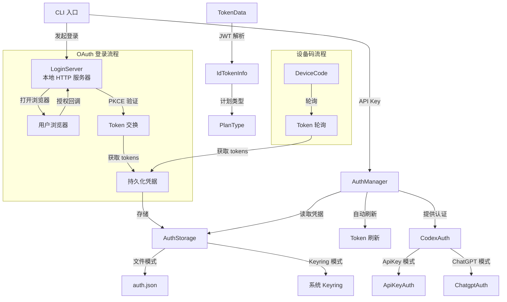

# login

## 功能概述

`codex-login` 是 Codex 项目的认证系统 crate，负责管理用户身份认证的完整生命周期。它支持两种认证方式：API Key 认证和 ChatGPT OAuth 认证（通过浏览器交互式登录）。

核心职责：
- 提供本地 OAuth 回调服务器，实现 PKCE（Proof Key for Code Exchange）安全授权码流程
- 管理认证凭据的存储、读取和刷新（支持文件和系统 Keyring 两种存储后端）
- JWT token 解析和验证（提取用户信息、计划类型、组织 ID 等声明）
- 提供 `AuthManager` 作为全局认证状态管理器，处理 token 过期自动刷新
- 支持设备码（Device Code）认证流程，用于无浏览器环境
- 支持工作区（Workspace）限制验证
- 提供登录成功/失败的 HTML 页面渲染

## 架构说明



## 目录结构

| 文件/目录 | 说明 |
|-----------|------|
| `src/lib.rs` | 库入口，统一导出所有公开类型 |
| `src/server.rs` | 本地 OAuth 回调服务器实现（核心文件，约 1000 行） |
| `src/token_data.rs` | JWT Token 数据结构和解析逻辑 |
| `src/pkce.rs` | PKCE（Proof Key for Code Exchange）代码生成 |
| `src/device_code_auth.rs` | 设备码认证流程实现 |
| `src/auth/` | 认证管理子模块 |
| `src/auth/mod.rs` | 认证模块入口 |
| `src/auth/manager.rs` | `AuthManager` 和 `CodexAuth` 核心认证管理器 |
| `src/auth/storage.rs` | 认证凭据存储后端（文件/Keyring） |
| `src/auth/default_client.rs` | 默认 HTTP 客户端构建和 User-Agent 管理 |
| `src/auth/error.rs` | 认证错误类型定义 |
| `src/auth/util.rs` | 认证工具函数 |
| `src/assets/` | 静态资源 |
| `src/assets/success.html` | 登录成功页面 |
| `src/assets/error.html` | 登录失败页面模板 |
| `src/token_data_tests.rs` | Token 数据解析测试 |

## 依赖关系

### 内部依赖

| 依赖 crate | 用途 |
|------------|------|
| `codex-client` | HTTP 客户端（用于 Custom CA 支持） |
| `codex-config` | 配置读取 |
| `codex-protocol` | 协议类型（`AuthMode`、`ForcedLoginMethod` 等） |
| `codex-app-server-protocol` | App Server 认证模式定义 |
| `codex-keyring-store` | 系统 Keyring 凭据存储 |
| `codex-terminal-detection` | 终端检测（判断是否可打开浏览器） |
| `codex-utils-template` | HTML 模板渲染引擎 |

### 外部依赖

| 依赖 | 用途 |
|------|------|
| `tiny_http` | 轻量级 HTTP 服务器（用于 OAuth 回调） |
| `reqwest` | HTTP 客户端（用于 token 交换和刷新） |
| `base64` | Base64 编解码（JWT payload 解码） |
| `sha2` | SHA-256 哈希（PKCE code_challenge 生成） |
| `rand` | 随机数生成（state 参数、PKCE code_verifier） |
| `chrono` | 日期时间处理（token 过期判断） |
| `url` / `urlencoding` | URL 解析和编码 |
| `webbrowser` | 打开系统浏览器 |
| `thiserror` | 错误类型派生 |
| `schemars` | JSON Schema 生成 |
| `tokio` | 异步运行时 |
| `once_cell` | 惰性初始化 |
| `os_info` | 操作系统信息获取 |

## 核心接口/API

### 认证管理器

```rust
/// 认证机制枚举
pub enum CodexAuth {
    ApiKey(ApiKeyAuth),              // API Key 模式
    Chatgpt(ChatgptAuth),           // ChatGPT OAuth 模式（带存储后端）
    ChatgptAuthTokens(ChatgptAuthTokens), // ChatGPT Token 模式（仅内存）
}

/// 全局认证管理器（共享实例）
pub struct AuthManager { ... }
impl AuthManager {
    /// 获取或创建共享的 AuthManager 实例
    pub fn shared(
        codex_home: PathBuf,
        enable_codex_api_key_env: bool,
        store_mode: AuthCredentialsStoreMode,
    ) -> AuthManager;
}

/// 认证凭据存储模式
pub enum AuthCredentialsStoreMode {
    File,     // 存储到 auth.json 文件
    Keyring,  // 存储到系统 Keyring
}
```

### 登录服务器

```rust
/// 登录服务器选项
pub struct ServerOptions {
    pub codex_home: PathBuf,
    pub client_id: String,
    pub issuer: String,
    pub port: u16,                    // 默认 1455
    pub open_browser: bool,
    pub force_state: Option<String>,
    pub forced_chatgpt_workspace_id: Option<String>,
    pub cli_auth_credentials_store_mode: AuthCredentialsStoreMode,
}

/// 运行中的登录服务器句柄
pub struct LoginServer {
    pub auth_url: String,      // 浏览器授权 URL
    pub actual_port: u16,      // 实际绑定的端口
}

impl LoginServer {
    pub async fn block_until_done(self) -> io::Result<()>;
    pub fn cancel(&self);
    pub fn cancel_handle(&self) -> ShutdownHandle;
}

/// 启动本地登录回调服务器
pub fn run_login_server(opts: ServerOptions) -> io::Result<LoginServer>;
```

### 设备码认证

```rust
pub struct DeviceCode { ... }
pub fn request_device_code(...) -> ...;
pub fn complete_device_code_login(...) -> ...;
pub fn run_device_code_login(...) -> ...;
```

### Token 数据

```rust
/// Token 数据（持久化结构）
pub struct TokenData {
    pub id_token: IdTokenInfo,
    pub access_token: String,
    pub refresh_token: String,
    pub account_id: Option<String>,
}

/// ID Token 解析后的信息
pub struct IdTokenInfo {
    pub email: Option<String>,
    pub chatgpt_plan_type: Option<PlanType>,
    pub chatgpt_user_id: Option<String>,
    pub chatgpt_account_id: Option<String>,
    pub raw_jwt: String,
}

/// 计划类型
pub enum PlanType {
    Known(KnownPlan),   // Free, Go, Plus, Pro, Team, Business, Enterprise, Edu 等
    Unknown(String),
}
```

### 认证持久化

```rust
/// auth.json 文件结构
pub struct AuthDotJson {
    pub auth_mode: Option<AuthMode>,
    pub openai_api_key: Option<String>,
    pub tokens: Option<TokenData>,
    pub last_refresh: Option<DateTime<Utc>>,
}

/// 保存认证信息
pub fn save_auth(codex_home: &Path, auth: &AuthDotJson, mode: AuthCredentialsStoreMode) -> io::Result<()>;
pub fn load_auth_dot_json(codex_home: &Path) -> ...;
pub fn login_with_api_key(...) -> ...;
pub fn logout(...) -> ...;
pub fn read_openai_api_key_from_env() -> Option<String>;
```

### 常量

```rust
pub const CLIENT_ID: &str;                    // OAuth Client ID
pub const CODEX_API_KEY_ENV_VAR: &str;        // Codex API Key 环境变量名
pub const OPENAI_API_KEY_ENV_VAR: &str;       // OpenAI API Key 环境变量名
pub const REFRESH_TOKEN_URL_OVERRIDE_ENV_VAR: &str;  // Token 刷新 URL 覆盖
```
