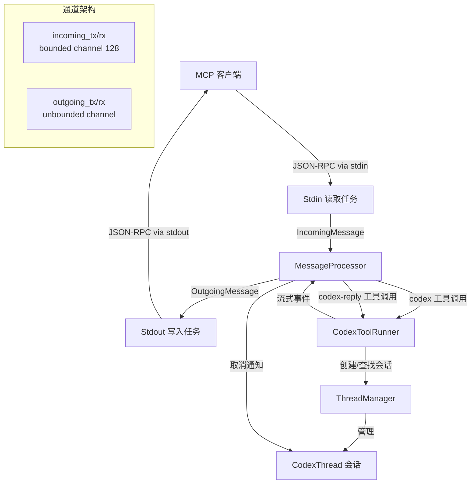

# mcp-server

## 功能概述

`codex-mcp-server` 是 Codex 项目的 MCP（Model Context Protocol）服务器实现。它通过标准输入/输出（stdin/stdout）与 MCP 客户端进行 JSON-RPC 通信，将 Codex 的 AI 编码能力暴露为 MCP 工具，使得任何兼容 MCP 协议的客户端（如 Claude Desktop、VS Code 等）都能调用 Codex 进行代码生成、修改和问答。

该 crate 既是一个可执行二进制文件（`codex-mcp-server`），也导出库接口供其他 crate 集成使用。

核心职责：
- 实现 MCP 协议的服务端，处理 `initialize`、`tools/list`、`tools/call` 等标准请求
- 提供两个 MCP 工具：`codex`（启动新会话）和 `codex-reply`（继续已有会话）
- 管理 Codex 会话的生命周期，包括创建、消息流转和中断取消
- 集成 OpenTelemetry 进行可观测性追踪

## 架构说明



## 目录结构

| 文件/目录 | 说明 |
|-----------|------|
| `src/main.rs` | 二进制入口，通过 `arg0_dispatch` 启动服务 |
| `src/lib.rs` | 库入口，定义 `run_main()` 函数，编排三个异步任务（stdin 读取、消息处理、stdout 写入） |
| `src/message_processor.rs` | MCP 协议核心处理器，分发所有 JSON-RPC 请求、响应和通知 |
| `src/codex_tool_config.rs` | `codex` 和 `codex-reply` 工具的参数定义和 JSON Schema 生成 |
| `src/codex_tool_runner.rs` | Codex 会话执行器，运行 AI 会话并将事件流回客户端 |
| `src/outgoing_message.rs` | 出站消息的封装和发送器 |
| `src/exec_approval.rs` | Shell 命令执行审批的 elicitation 参数定义 |
| `src/patch_approval.rs` | 补丁应用审批的 elicitation 参数定义 |
| `src/tool_handlers/` | 工具处理器子模块 |

## 依赖关系

### 内部依赖

| 依赖 crate | 用途 |
|------------|------|
| `codex-core` | 核心业务逻辑，提供 `Config`、`ThreadManager`、`AuthManager` 等 |
| `codex-protocol` | 协议定义，包括 `ThreadId`、`Submission`、`Op` 等类型 |
| `codex-exec-server` | 执行环境管理（`EnvironmentManager`） |
| `codex-features` | 功能特性开关 |
| `codex-arg0` | 命令行参数派发路径管理 |
| `codex-shell-command` | Shell 命令处理 |
| `codex-utils-cli` | CLI 配置覆盖工具 |
| `codex-utils-json-to-toml` | JSON 到 TOML 格式转换 |

### 外部依赖

| 依赖 | 用途 |
|------|------|
| `rmcp` | MCP 协议的 Rust 实现库，提供 JSON-RPC 消息类型和工具定义 |
| `schemars` | JSON Schema 自动生成（用于工具输入参数定义） |
| `tokio` | 异步运行时（多线程、I/O、信号处理） |
| `serde` / `serde_json` | 序列化/反序列化 |
| `tracing` / `tracing-subscriber` | 结构化日志和追踪 |
| `shlex` | Shell 命令解析 |

## 核心接口/API

### 公开类型

```rust
/// 启动 MCP 服务器的主入口函数
pub async fn run_main(
    arg0_paths: Arg0DispatchPaths,
    cli_config_overrides: CliConfigOverrides,
) -> IoResult<()>

/// codex 工具调用参数（MCP tool input schema）
pub struct CodexToolCallParam {
    pub prompt: String,                              // 必填：初始用户提示
    pub model: Option<String>,                       // 模型名称覆盖
    pub profile: Option<String>,                     // 配置 profile
    pub cwd: Option<String>,                         // 工作目录
    pub approval_policy: Option<CodexToolCallApprovalPolicy>,  // 审批策略
    pub sandbox: Option<CodexToolCallSandboxMode>,   // 沙箱模式
    pub config: Option<HashMap<String, Value>>,      // 额外配置覆盖
    pub base_instructions: Option<String>,           // 基础指令
    pub developer_instructions: Option<String>,      // 开发者指令
    pub compact_prompt: Option<String>,              // 压缩提示词
}

/// codex-reply 工具调用参数
pub struct CodexToolCallReplyParam {
    pub thread_id: Option<String>,  // 会话线程 ID
    pub prompt: String,             // 继续对话的用户提示
}

/// 执行审批参数
pub struct ExecApprovalElicitRequestParams { ... }
pub struct ExecApprovalResponse { ... }

/// 补丁审批参数
pub struct PatchApprovalElicitRequestParams { ... }
pub struct PatchApprovalResponse { ... }
```

### MCP 工具定义

| 工具名 | 说明 | 必填参数 |
|--------|------|----------|
| `codex` | 启动一个新的 Codex AI 编码会话 | `prompt` |
| `codex-reply` | 在已有会话中继续对话 | `prompt`（`threadId` 或 `conversationId` 二选一） |
