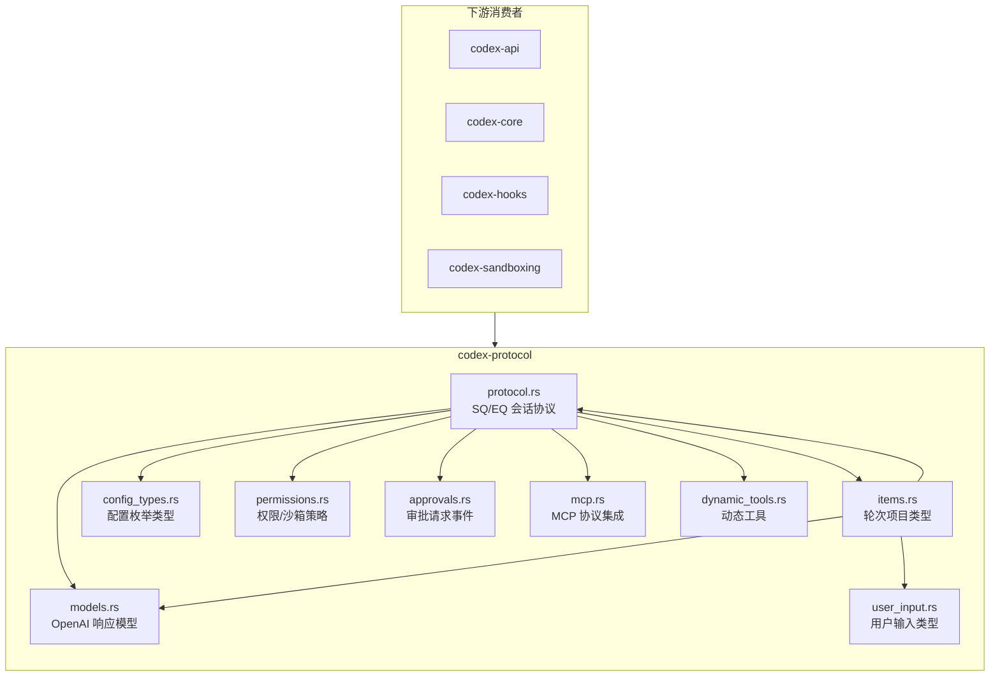

# protocol

## 功能概述

`codex-protocol` 是 Codex 项目的基础协议类型定义 crate，定义了客户端与 Agent 之间会话通信的核心数据结构。该 crate 采用 SQ（提交队列）/ EQ（事件队列）模式实现异步通信，涵盖了会话消息、工具调用审批、沙箱策略、MCP 协议集成、模型配置、权限管理等全部协议层面的类型定义。它是整个 Codex Rust 生态系统中被依赖最广泛的基础 crate。

## 架构说明

## 目录结构

| 文件/目录 | 说明 |
|-----------|------|
| `src/lib.rs` | crate 入口，导出所有公共模块 |
| `src/protocol.rs` | 核心会话协议，定义 `Op`（提交队列操作）和 `EventMsg`（事件队列消息），包括会话配置、工具调用、审批流程等 |
| `src/models.rs` | OpenAI Responses API 相关模型类型，如 `ResponseItem`、`ContentItem`、`SandboxPolicy` 等 |
| `src/items.rs` | 轮次项目类型定义，包括 `TurnItem`、`UserMessageItem`、`AgentMessageItem`、`ReasoningItem` 等 |
| `src/config_types.rs` | 配置枚举类型，如 `SandboxMode`、`CollaborationMode`、`ModeKind`、`Personality`、`WebSearchMode` 等 |
| `src/permissions.rs` | 文件系统和网络沙箱策略类型，包括 `FileSystemSandboxPolicy`、`NetworkSandboxPolicy` |
| `src/approvals.rs` | 审批请求事件类型，如 `ExecApprovalRequestEvent`、`ElicitationRequestEvent`、`GuardianAssessmentEvent` |
| `src/mcp.rs` | MCP（Model Context Protocol）集成类型，包括工具、资源、资源模板等 |
| `src/dynamic_tools.rs` | 动态工具调用的请求和响应类型 |
| `src/user_input.rs` | 用户输入类型，支持文本、图片、本地图片等多模态输入 |
| `src/openai_models.rs` | OpenAI 模型相关类型，如 `ReasoningEffort` |
| `src/memory_citation.rs` | 记忆引用类型 |
| `src/message_history.rs` | 消息历史记录类型 |
| `src/num_format.rs` | 数字格式化工具（支持区域化分隔符） |
| `src/parse_command.rs` | 命令解析工具 |
| `src/plan_tool.rs` | 计划工具类型 |
| `src/account.rs` | 账户相关类型 |
| `src/agent_path.rs` | Agent 路径类型 `AgentPath` |
| `src/thread_id.rs` | 线程 ID 类型 `ThreadId` |
| `src/request_permissions.rs` | 权限请求事件 |
| `src/request_user_input.rs` | 用户输入请求 |
| `src/prompts/` | 提示词模板目录 |

## 依赖关系

### 内部依赖

| 依赖 crate | 说明 |
|------------|------|
| `codex-execpolicy` | 执行策略定义 |
| `codex-git-utils` | Git 工具（如 `GhostCommit`、`GitSha`） |
| `codex-utils-absolute-path` | 绝对路径工具类型 `AbsolutePathBuf` |
| `codex-utils-image` | 图片处理工具 |
| `codex-utils-string` | 字符串工具 |
| `codex-utils-template` | 模板引擎 |

### 外部依赖

| 依赖 | 说明 |
|------|------|
| `serde` / `serde_json` | JSON 序列化/反序列化 |
| `schemars` | JSON Schema 生成 |
| `ts-rs` | TypeScript 类型绑定生成 |
| `uuid` | UUID 生成（v4 和 v7） |
| `quick-xml` | XML 序列化/反序列化（用于 hook prompt） |
| `strum` / `strum_macros` | 枚举字符串转换 |
| `icu_decimal` / `icu_locale_core` / `icu_provider` | ICU 国际化数字格式化 |
| `sys-locale` | 系统区域检测 |
| `serde_with` | 高级序列化支持（base64 等） |
| `tracing` | 日志追踪 |

## 核心接口/API

### 会话协议

- **`Op`** - 提交队列操作枚举，客户端向 Agent 发送的指令（如 `UserInput`、`McpToolCallOutput`、`ApprovalResponse` 等）
- **`EventMsg`** - 事件队列消息枚举，Agent 向客户端发送的事件（如 `AgentMessage`、`ExecApprovalRequest`、`TaskComplete` 等）

### 轮次项目

- **`TurnItem`** - 会话轮次中的项目枚举（`UserMessage`、`AgentMessage`、`Reasoning`、`WebSearch`、`ImageGeneration`、`ContextCompaction` 等）
- **`UserMessageItem`** - 用户消息项，支持多模态内容
- **`AgentMessageItem`** - Agent 消息项，包含可选的 `phase` 和 `memory_citation` 元数据
- **`HookPromptItem`** - Hook 注入的提示消息项

### 配置类型

- **`SandboxMode`** - 沙箱模式枚举：`ReadOnly`、`WorkspaceWrite`、`DangerFullAccess`
- **`CollaborationMode`** - 协作模式，包含 `ModeKind`（`Plan` / `Default`）和 `Settings`（模型、推理力度、开发者指令）
- **`Personality`** - 人格类型：`None`、`Friendly`、`Pragmatic`
- **`WebSearchMode`** - 网页搜索模式：`Disabled`、`Cached`、`Live`
- **`ApprovalsReviewer`** - 审批审阅者：`User`、`GuardianSubagent`

### 模型类型

- **`ResponseItem`** - OpenAI Responses API 的响应条目（`Message`、`FunctionCall`、`FunctionCallOutput` 等）
- **`ContentItem`** - 内容项枚举（`InputText`、`OutputText`、`InputImage`、`InputFile` 等）
- **`SandboxPolicy`** - 沙箱策略枚举（`ReadOnly`、`WorkspaceWrite`、`DangerFullAccess`、`ExternalSandbox`）

### 权限类型

- **`FileSystemSandboxPolicy`** - 文件系统沙箱策略（`Restricted` / `Unrestricted` / `ExternalSandbox`）
- **`NetworkSandboxPolicy`** - 网络沙箱策略（`Enabled` / `Restricted`）

### 工具函数

- **`AgentPath`** - Agent 路径标识类型
- **`ThreadId`** - 会话线程 ID 类型
- **`build_hook_prompt_message()`** / **`parse_hook_prompt_message()`** - Hook 提示消息的构建与解析
