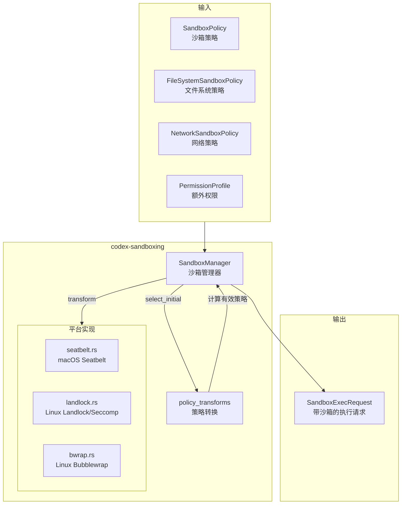

# sandboxing

## 功能概述

`codex-sandboxing` 是 Codex 项目的沙箱管理 crate，负责在不同操作系统平台上为命令执行提供安全沙箱隔离。它支持 macOS 的 Seatbelt（`sandbox-exec`）、Linux 的 Landlock + Seccomp（通过 `codex-linux-sandbox` 或 `bwrap`）以及 Windows 的受限令牌（Restricted Token）三种沙箱机制。该 crate 根据配置的沙箱策略（文件系统访问控制、网络访问控制）将原始命令转换为带有沙箱包装的命令，确保 AI Agent 执行的命令受到适当的安全约束。

## 架构说明

## 目录结构

| 文件/目录 | 说明 |
|-----------|------|
| `src/lib.rs` | crate 入口，按平台条件编译导出模块，定义 `system_bwrap_warning()` 跨平台回退 |
| `src/manager.rs` | **核心模块** - `SandboxManager`、`SandboxType`、`SandboxCommand`、`SandboxExecRequest`、`SandboxTransformRequest` 类型定义及沙箱选择/转换逻辑 |
| `src/manager_tests.rs` | SandboxManager 单元测试 |
| `src/policy_transforms.rs` | 策略转换逻辑 - 计算有效沙箱策略、合并/交集权限配置文件、归一化路径等 |
| `src/policy_transforms_tests.rs` | 策略转换单元测试 |
| `src/seatbelt.rs` | macOS Seatbelt 实现 - 基于 SBPL（Sandbox Profile Language）生成 `sandbox-exec` 命令参数 |
| `src/seatbelt_base_policy.sbpl` | Seatbelt 基础策略模板 |
| `src/seatbelt_network_policy.sbpl` | Seatbelt 网络策略模板 |
| `src/seatbelt_tests.rs` | Seatbelt 单元测试 |
| `src/restricted_read_only_platform_defaults.sbpl` | 受限只读平台默认策略 |
| `src/landlock.rs` | Linux Landlock + Seccomp 实现 - 生成 `codex-linux-sandbox` 命令参数 |
| `src/landlock_tests.rs` | Landlock 单元测试 |
| `src/bwrap.rs` | Linux Bubblewrap（bwrap）实现 - 系统级 bwrap 工具检测和警告 |
| `src/bwrap_tests.rs` | Bubblewrap 单元测试 |

## 依赖关系

### 内部依赖

| 依赖 crate | 说明 |
|------------|------|
| `codex-protocol` | 沙箱策略类型（`SandboxPolicy`、`FileSystemSandboxPolicy`、`NetworkSandboxPolicy`、`PermissionProfile`、`WindowsSandboxLevel`） |
| `codex-network-proxy` | 网络代理类型 `NetworkProxy`（用于受管网络场景） |
| `codex-utils-absolute-path` | 绝对路径工具 |

### 外部依赖

| 依赖 | 说明 |
|------|------|
| `libc` | POSIX 系统调用绑定 |
| `dunce` | Windows 风格路径规范化（去除 UNC 前缀） |
| `serde_json` | JSON 序列化 |
| `url` | URL 解析 |
| `which` | 可执行文件路径查找 |
| `tracing` | 日志追踪 |

## 核心接口/API

### 沙箱管理器

- **`SandboxManager`** - 沙箱管理器（无状态单例）
  - `new()` - 创建实例
  - `select_initial()` - 根据文件系统策略、网络策略、用户偏好和 Windows 沙箱级别，选择初始沙箱类型
  - `transform()` - 将 `SandboxTransformRequest` 转换为 `SandboxExecRequest`，在原始命令外包装平台特定的沙箱机制

### 沙箱类型

- **`SandboxType`** - 沙箱类型枚举
  - `None` - 无沙箱
  - `MacosSeatbelt` - macOS `sandbox-exec` (Seatbelt)
  - `LinuxSeccomp` - Linux Landlock + Seccomp（通过 `codex-linux-sandbox`）
  - `WindowsRestrictedToken` - Windows 受限令牌
  - `as_metric_tag()` - 返回用于指标的标签字符串

### 请求/响应类型

- **`SandboxCommand`** - 待沙箱化的原始命令（程序路径、参数、工作目录、环境变量、额外权限）
- **`SandboxTransformRequest`** - 沙箱转换请求，包含命令、策略、沙箱类型、网络代理等全部上下文
- **`SandboxExecRequest`** - 转换后的执行请求，包含沙箱包装后的命令行、有效策略等
- **`SandboxablePreference`** - 沙箱偏好枚举：`Auto`（自动检测）、`Require`（强制启用）、`Forbid`（禁用）

### 策略转换

- **`EffectiveSandboxPermissions`** - 计算合并额外权限后的有效沙箱策略
- **`effective_file_system_sandbox_policy()`** - 合并额外文件系统权限到基础策略
- **`effective_network_sandbox_policy()`** - 合并额外网络权限到基础策略
- **`should_require_platform_sandbox()`** - 判断当前策略组合是否需要启用平台沙箱
- **`normalize_additional_permissions()`** - 归一化和规范化额外权限路径
- **`merge_permission_profiles()`** - 合并两个权限配置文件
- **`intersect_permission_profiles()`** - 计算两个权限配置文件的交集

### 平台函数

- **`get_platform_sandbox()`** - 根据当前平台返回可用的沙箱类型
- **`system_bwrap_warning()`** - 检测系统 bwrap 工具并返回兼容性警告（仅 Linux）
- **`find_system_bwrap_in_path()`** - 在 PATH 中查找系统 bwrap 可执行文件（仅 Linux）
