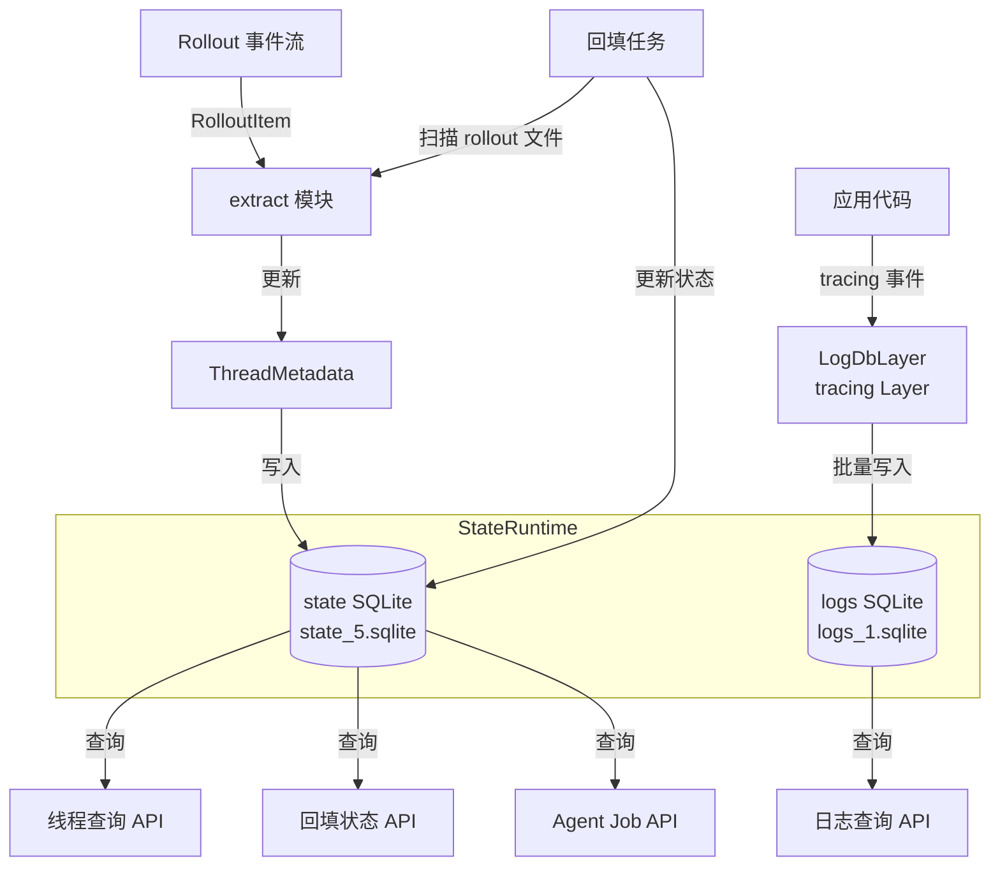

# state

## 功能概述

`codex-state` 是 Codex 项目的状态持久化 crate，基于 SQLite 数据库实现会话元数据和日志的本地存储。它从 JSONL 格式的 rollout 文件中提取会话元数据（如对话线程信息、token 统计、用户消息等），并将其镜像到本地 SQLite 数据库中，同时提供结构化的 tracing 日志持久化能力。

核心职责：
- 维护两个独立的 SQLite 数据库：`state` 数据库（会话元数据）和 `logs` 数据库（结构化日志）
- 从 rollout 事件流中提取和更新线程（Thread）元数据
- 提供 tracing Layer 将应用日志写入 SQLite，支持批量写入和自动过期清理
- 管理数据库迁移和版本控制，自动清理旧版本数据库文件
- 支持 Agent Job 管理（创建、状态追踪、进度查询）
- 提供回填（backfill）机制从历史 rollout 文件恢复元数据

## 架构说明



## 目录结构

| 文件/目录 | 说明 |
|-----------|------|
| `src/lib.rs` | 库入口，导出公开类型和常量，定义数据库文件名和版本号 |
| `src/runtime.rs` | `StateRuntime` 核心结构体，管理两个 SQLite 连接池的初始化和生命周期 |
| `src/extract.rs` | Rollout 事件提取器，将 `RolloutItem` 应用到 `ThreadMetadata` |
| `src/log_db.rs` | tracing Layer 实现，将日志事件批量写入 logs SQLite 数据库 |
| `src/migrations.rs` | 数据库迁移器定义 |
| `src/paths.rs` | 文件路径工具（如文件修改时间获取） |
| `src/model/` | 数据模型定义子目录 |
| `src/model/mod.rs` | 模型模块入口 |
| `src/model/thread_metadata.rs` | 线程元数据结构体定义 |
| `src/model/agent_job.rs` | Agent Job 相关模型（任务创建、状态、进度） |
| `src/model/backfill_state.rs` | 回填状态模型 |
| `src/model/log.rs` | 日志条目模型 |
| `src/model/graph.rs` | 线程关系图模型 |
| `src/model/memories.rs` | 记忆存储模型 |
| `src/runtime/` | 运行时子模块 |
| `src/runtime/threads.rs` | 线程元数据的 CRUD 操作 |
| `src/runtime/backfill.rs` | 回填逻辑实现 |
| `src/runtime/agent_jobs.rs` | Agent Job 的数据库操作 |
| `src/runtime/logs.rs` | 日志的数据库操作 |
| `src/runtime/memories.rs` | 记忆数据的数据库操作 |
| `src/bin/` | 辅助二进制工具 |

## 依赖关系

### 内部依赖

| 依赖 crate | 用途 |
|------------|------|
| `codex-protocol` | 协议类型定义（`ThreadId`、`RolloutItem`、`EventMsg` 等） |

### 外部依赖

| 依赖 | 用途 |
|------|------|
| `sqlx` | 异步 SQLite 数据库驱动和迁移框架 |
| `tokio` | 异步运行时（文件 I/O、定时器、同步原语） |
| `chrono` | 日期时间处理 |
| `serde` / `serde_json` | 序列化/反序列化 |
| `tracing` / `tracing-subscriber` | 结构化日志框架（用于实现 `LogDbLayer`） |
| `uuid` | UUID 生成（进程日志标识） |
| `clap` | 命令行参数解析 |
| `dirs` | 系统目录路径获取 |
| `strum` | 枚举宏派生 |
| `owo-colors` | 终端彩色输出 |

## 核心接口/API

### StateRuntime

```rust
/// 状态运行时 -- 拥有和管理 SQLite 连接池
#[derive(Clone)]
pub struct StateRuntime {
    codex_home: PathBuf,
    default_provider: String,
    pool: Arc<SqlitePool>,       // state 数据库连接池
    logs_pool: Arc<SqlitePool>,  // logs 数据库连接池
}

impl StateRuntime {
    /// 初始化状态运行时，创建并迁移 SQLite 数据库
    pub async fn init(codex_home: PathBuf, default_provider: String) -> anyhow::Result<Arc<Self>>;

    /// 获取配置的 Codex Home 目录
    pub fn codex_home(&self) -> &Path;
}
```

### 线程元数据

```rust
/// 线程元数据结构体
pub struct ThreadMetadata { ... }
pub struct ThreadMetadataBuilder { ... }
pub struct ThreadsPage { ... }

/// 排序和分页
pub enum SortKey { ... }
pub struct Anchor { ... }
```

### 日志系统

```rust
/// 启动日志 tracing Layer
pub fn log_db::start(state_db: Arc<StateRuntime>) -> LogDbLayer;

/// 日志条目
pub struct LogEntry {
    pub ts: i64,
    pub ts_nanos: i64,
    pub level: String,
    pub target: String,
    pub message: Option<String>,
    pub feedback_log_body: Option<String>,
    pub thread_id: Option<String>,
    pub process_uuid: Option<String>,
    pub module_path: Option<String>,
    pub file: Option<String>,
    pub line: Option<i64>,
}

/// 日志查询参数
pub struct LogQuery { ... }
pub struct LogRow { ... }
```

### Agent Job 管理

```rust
pub struct AgentJob { ... }
pub struct AgentJobCreateParams { ... }
pub struct AgentJobItem { ... }
pub struct AgentJobItemCreateParams { ... }
pub enum AgentJobStatus { ... }
pub enum AgentJobItemStatus { ... }
pub struct AgentJobProgress { ... }
```

### Rollout 提取

```rust
/// 将 rollout 事件应用到线程元数据
pub fn apply_rollout_item(metadata: &mut ThreadMetadata, item: &RolloutItem, default_provider: &str);

/// 判断 rollout 事件是否影响线程元数据
pub fn rollout_item_affects_thread_metadata(item: &RolloutItem) -> bool;
```

### 路径工具函数

```rust
pub fn state_db_filename() -> String;     // "state_5.sqlite"
pub fn state_db_path(codex_home: &Path) -> PathBuf;
pub fn logs_db_filename() -> String;      // "logs_1.sqlite"
pub fn logs_db_path(codex_home: &Path) -> PathBuf;
```
