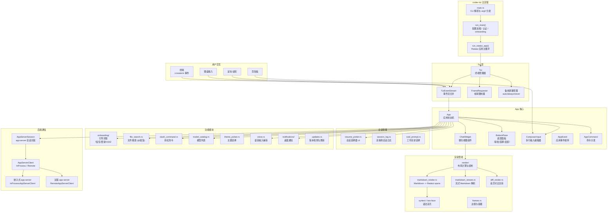

# tui

## 功能概述

`codex-tui` 是 Codex 项目的终端用户界面 crate，基于 [Ratatui](https://ratatui.rs/) 框架构建，提供完整的交互式终端体验。它是用户通过 `codex` 命令（无子命令）或 `codex-tui` 二进制直接交互的主要界面。

核心功能包括：

- **全功能聊天界面**：Markdown 渲染、语法高亮、代码差异对比、流式输出显示
- **会话管理**：新建会话、恢复（resume）、分支（fork）历史会话，支持按 ID 或名称查找
- **引导流程（Onboarding）**：首次使用时的目录信任确认、登录认证、OSS 提供商选择
- **Composer 输入**：多行文本编辑、图片附件、文件搜索（`@`提及）、剪贴板粘贴
- **审批工作流**：命令执行审批、文件变更审批、权限请求审批
- **多 Agent 导航**：在多个并行 Agent 线程之间切换浏览
- **终端适配**：备用屏幕（alternate screen）自动检测（Zellij 兼容）、Kitty/iTerm2 键盘增强、桌面通知
- **语音输入**：通过 `cpal` 实现实时音频捕获（可选 feature）
- **远程模式**：通过 WebSocket 连接远程 app-server 实例
- **更新提示**：自动检测 CLI 更新并提供升级引导

## 架构说明



### 整体架构流程

1. **启动阶段**：`main.rs` 解析 CLI 参数，调用 `run_main()`。该函数负责加载配置、解析 CLI 覆盖、处理 OSS 提供商选择、初始化 tracing 日志和 OpenTelemetry。

2. **引导阶段**：`run_ratatui_app()` 首先初始化 Ratatui 终端，然后依次运行更新提示（release builds）、引导流程（目录信任确认 + 登录认证）。

3. **会话查找**：根据 CLI 参数（`--resume`、`--fork`、`--last`、session ID）启动临时 app-server 实例进行会话查找。

4. **主应用循环**：`App::run()` 进入事件驱动的主循环，同时消费 `TuiEventStream`（终端事件）和 `AppServerSession`（app-server 事件）。App 状态机处理键盘输入、命令执行、审批流程、Agent 消息渲染等。

5. **渲染管线**：每帧通过 `Tui::draw()` 进入 synchronized update，计算布局后绘制聊天历史、输入框、状态栏、底部面板等。

6. **后端通信**：`AppServerSession` 封装了与 app-server 的 JSON-RPC 通信，支持嵌入式（进程内）和远程（WebSocket）两种模式。

## 目录结构

| 文件/目录 | 说明 |
|---|---|
| `src/lib.rs` | 库入口，`run_main()` 函数、嵌入式/远程 app-server 启动、会话查找逻辑 |
| `src/main.rs` | 独立二进制入口，CLI 解析与 arg0 分发 |
| `src/app.rs` | `App` 核心状态机，管理整体应用状态与事件处理 |
| `src/app/` | App 子模块（Agent 导航、app-server 适配器、请求处理、已加载线程管理） |
| `src/tui.rs` | `Tui` 终端管理器，封装 Ratatui Terminal、事件流、备用屏幕、绘制调度 |
| `src/tui/` | Tui 子模块（event_stream、frame_rate_limiter、frame_requester、job_control） |
| `src/cli.rs` | `Cli` 结构体定义（TUI 专属命令行参数） |
| `src/chatwidget.rs` | `ChatWidget` 聊天视图组件 |
| `src/chatwidget/` | 聊天组件子模块 |
| `src/bottom_pane/` | 底部面板（审批确认、选择列表、MCP elicitation、反馈） |
| `src/render/` | 渲染管线（布局计算、高亮、可渲染组件） |
| `src/markdown_render.rs` | Markdown 到 Ratatui spans 的转换 |
| `src/markdown_stream.rs` | 流式 Markdown 增量解析 |
| `src/markdown.rs` | Markdown 基础类型 |
| `src/diff_render.rs` | 差异对比渲染（diffy 集成） |
| `src/onboarding/` | 引导流程 UI（目录信任、登录、OSS 选择） |
| `src/resume_picker.rs` | 会话恢复/分支选择器 UI |
| `src/cwd_prompt.rs` | 工作目录不匹配时的选择提示 |
| `src/file_search.rs` | 文件搜索管理器（@提及） |
| `src/slash_command.rs` | 斜杠命令处理 |
| `src/model_catalog.rs` | 模型列表管理 |
| `src/model_migration.rs` | 模型迁移提示 |
| `src/multi_agents.rs` | 多 Agent 导航与显示 |
| `src/collaboration_modes.rs` | 协作模式 |
| `src/exec_cell/` | 命令执行单元格渲染 |
| `src/exec_command.rs` | Shell 命令解析与显示 |
| `src/history_cell.rs` | 历史消息单元格 |
| `src/streaming/` | 流式输出处理 |
| `src/voice.rs` | 语音输入捕获（cpal，可选 feature） |
| `src/audio_device.rs` | 音频设备管理 |
| `src/notifications/` | 桌面通知后端 |
| `src/external_editor.rs` | 外部编辑器集成 |
| `src/pager_overlay.rs` | 全屏滚动 Overlay |
| `src/app_server_session.rs` | app-server 会话封装 |
| `src/app_event.rs` | `AppEvent` 枚举定义 |
| `src/app_event_sender.rs` | 事件发送器 |
| `src/app_command.rs` | 应用命令分发 |
| `src/app_backtrack.rs` | 回退（backtrack）状态管理 |
| `src/style.rs` | 样式常量 |
| `src/color.rs` | 颜色工具 |
| `src/theme_picker.rs` | 语法高亮主题选择器 |
| `src/terminal_palette.rs` | 终端调色板检测 |
| `src/terminal_title.rs` | 终端标题设置 |
| `src/ui_consts.rs` | UI 布局常量 |
| `src/key_hint.rs` | 快捷键提示 |
| `src/tooltips.rs` | 工具提示 |
| `src/shimmer.rs` | 闪烁加载动画 |
| `src/ascii_animation.rs` | ASCII 动画 |
| `src/frames.rs` | 边框与容器 |
| `src/selection_list.rs` | 通用选择列表组件 |
| `src/status/` | 状态栏组件 |
| `src/status_indicator_widget.rs` | 状态指示器 |
| `src/wrapping.rs` | 文本换行 |
| `src/live_wrap.rs` | 实时换行 |
| `src/line_truncation.rs` | 行截断 |
| `src/text_formatting.rs` | 文本格式化 |
| `src/mention_codec.rs` | @提及编解码 |
| `src/clipboard_text.rs` | 剪贴板文本处理 |
| `src/clipboard_paste.rs` | 剪贴板粘贴 |
| `src/get_git_diff.rs` | Git diff 获取 |
| `src/session_log.rs` | 高保真会话事件日志 |
| `src/local_chatgpt_auth.rs` | ChatGPT 本地认证 |
| `src/oss_selection.rs` | OSS 提供商选择 UI |
| `src/version.rs` | 版本信息 |
| `src/updates.rs` | 版本更新检测 |
| `src/update_prompt.rs` | 更新提示 UI |
| `src/update_action.rs` | 更新操作执行 |
| `src/debug_config.rs` | 调试配置 |
| `src/skills_helpers.rs` | Skills 辅助 |
| `src/additional_dirs.rs` | 附加目录验证 |
| `src/custom_terminal.rs` | 自定义 Terminal 扩展 |
| `src/public_widgets/` | 公开 widget（ComposerInput 等） |
| `src/snapshots/` | 快照测试数据 |
| `src/test_backend.rs` | 测试用终端后端 |
| `src/test_support.rs` | 测试辅助工具 |

## 依赖关系

### 内部依赖

| Crate | 用途 |
|---|---|
| `codex-core` | 核心配置加载、认证、路径工具、OTel 初始化 |
| `codex-app-server-client` | app-server 客户端封装（InProcess + Remote） |
| `codex-app-server-protocol` | JSON-RPC 消息类型 |
| `codex-protocol` | 通用协议类型（ThreadId、SessionSource、config_types） |
| `codex-arg0` | argv0 分发 |
| `codex-ansi-escape` | ANSI 转义处理 |
| `codex-chatgpt` | ChatGPT 后端 |
| `codex-cloud-requirements` | 云端需求 |
| `codex-feedback` | 反馈收集 |
| `codex-features` | 功能标志 |
| `codex-file-search` | 文件搜索 |
| `codex-git-utils` | Git 工具 |
| `codex-login` | 登录认证 |
| `codex-otel` | OpenTelemetry |
| `codex-shell-command` | Shell 命令解析 |
| `codex-state` | 状态数据库 |
| `codex-terminal-detection` | 终端环境检测 |
| `codex-utils-*` | 各类工具 crate（approval-presets, absolute-path, elapsed, fuzzy-match, oss, sandbox-summary, sleep-inhibitor, string, cli） |
| `codex-windows-sandbox` | Windows 沙箱 |

### 主要外部依赖

| Crate | 用途 |
|---|---|
| `ratatui` / `ratatui-macros` | TUI 框架（scrolling-regions, unstable-backend-writer 等 feature） |
| `crossterm` | 终端事件与控制（bracketed-paste, event-stream） |
| `tokio` / `tokio-stream` | 异步运行时 |
| `pulldown-cmark` | Markdown 解析 |
| `syntect` / `two-face` | 语法高亮 |
| `diffy` | 文本差异对比 |
| `textwrap` | 文本换行 |
| `unicode-width` / `unicode-segmentation` | Unicode 宽度与分段 |
| `image` | 图片格式支持（jpeg, png, gif, webp） |
| `color-eyre` | 错误报告 |
| `clap` | CLI 参数解析 |
| `serde` / `serde_json` | 序列化 |
| `tracing` / `tracing-appender` / `tracing-subscriber` | 日志 |
| `webbrowser` | 浏览器打开 |
| `arboard` | 剪贴板访问 |
| `cpal` | 音频捕获（可选 feature: voice-input） |
| `reqwest` | HTTP 客户端 |
| `url` | URL 解析 |

## 核心接口/API

### 公开函数

```rust
/// TUI 主入口函数
pub async fn run_main(
    cli: Cli,
    arg0_paths: Arg0DispatchPaths,
    loader_overrides: LoaderOverrides,
    remote: Option<String>,
    remote_auth_token: Option<String>,
) -> std::io::Result<AppExitInfo>

/// 标准化远程地址
pub fn normalize_remote_addr(addr: &str) -> color_eyre::Result<String>

/// Markdown 文本渲染
pub fn render_markdown_text(...) -> ...
```

### 公开类型

```rust
/// TUI CLI 参数
pub struct Cli {
    pub prompt: Option<String>,
    pub images: Vec<PathBuf>,
    pub model: Option<String>,
    pub oss: bool,
    pub full_auto: bool,
    pub sandbox_mode: Option<SandboxModeCliArg>,
    pub approval_policy: Option<ApprovalModeCliArg>,
    pub resume_session_id: Option<String>,
    pub fork_session_id: Option<String>,
    pub no_alt_screen: bool,
    // ... 更多字段
}

/// 应用退出信息
pub struct AppExitInfo {
    pub token_usage: TokenUsage,
    pub thread_id: Option<ThreadId>,
    pub thread_name: Option<String>,
    pub update_action: Option<UpdateAction>,
    pub exit_reason: ExitReason,
}

/// 退出原因
pub enum ExitReason {
    UserRequested,
    Fatal(String),
}

/// Composer 输入组件（公开 widget）
pub struct ComposerInput { ... }
pub enum ComposerAction { ... }

/// 更新操作
pub struct UpdateAction { ... }
```

### 内部核心类型

```rust
/// 应用状态机（核心循环驱动器）
struct App { ... }
impl App {
    async fn run(tui, app_server, config, ...) -> AppExitInfo;
}

/// 终端管理器
pub struct Tui {
    pub fn new(terminal: Terminal) -> Self;
    pub fn event_stream(&self) -> Pin<Box<dyn Stream<Item = TuiEvent>>>;
    pub fn draw(&mut self, height, draw_fn) -> Result<()>;
    pub fn enter_alt_screen(&mut self) -> Result<()>;
    pub fn leave_alt_screen(&mut self) -> Result<()>;
    pub async fn with_restored<R, F, Fut>(&mut self, mode, f) -> R;
    pub fn notify(&mut self, message) -> bool;
}

/// TUI 事件
pub enum TuiEvent {
    Key(KeyEvent),
    Paste(String),
    Draw,
}

/// App-server 连接目标
enum AppServerTarget {
    Embedded,
    Remote { websocket_url: String, auth_token: Option<String> },
}
```
