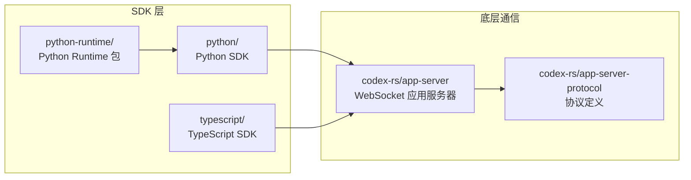

# sdk — Codex SDK 总览

## 功能概述

`sdk/` 目录包含 Codex 的多语言 SDK 实现，允许开发者以编程方式集成和使用 Codex 代理能力。提供 Python 和 TypeScript 两种语言的 SDK。

## 架构说明

## 目录结构

| 子目录 | 说明 |
|--------|------|
| `python/` | **Python SDK** — 完整的 Python 客户端库，包含示例、文档、测试 |
| `python-runtime/` | **Python Runtime** — 运行时支持包，为 Python SDK 提供底层 Codex 二进制依赖 |
| `typescript/` | **TypeScript SDK** — TypeScript/Node.js 客户端库 |

## 依赖关系

### 内部依赖
- 所有 SDK 通过 WebSocket 与 `codex-rs/app-server` 通信
- 协议定义来自 `codex-rs/app-server-protocol`
- Python Runtime 包依赖 Codex Rust 二进制文件

### 外部依赖
- Python SDK：见 `python/pyproject.toml`
- TypeScript SDK：见 `typescript/package.json`
